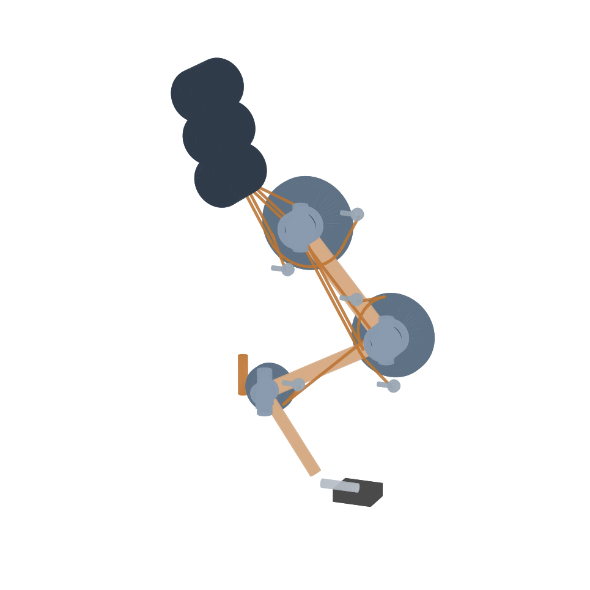

# Project T.O.M.C.A.T.

**Tendon-Operated Mechanism for a Compliant Actuated Tomcat**

A community-driven, open quadruped robot that uses synthetic cables (tendons)
pulled by rotary motors instead of a rigid gear/actuator at every joint. This
biomimetic design mimics feline musculoskeletal structure to provide flexible,
cat-like agility, energy-efficient movement, and passive shock absorption.

> The name is a backronym: **T**endon-**O**perated **M**echanism for a
> **C**ompliant **A**ctuated **T**omcat — advanced in intent, community-driven
> in spirit.

## Progress

Forty-four milestones in. The model now spans kinematics → real mass → 3D
static stability → whole-body dynamics → a dynamic gait → closed-loop balance →
an independent physics-engine cross-check → thermal duty → whole-body force
allocation, with **431 passing + 5 suspended Python tests and 17 Rust** and every figure below
generated from the live model (`python tools/make_progress_figures.py`), so a
published number cannot drift from the code.

### Locomotion

Two gaits, and the gap between them is the story. The statically stable crawl is
a **1.1 cm/s** shuffle; the diagonal **trot reaches 50 cm/s** — slowed from 67 because the spine's
balance assist has to push against the ground, and that demand scales as
1/stance². The motors would allow ~96 cm/s on a better floor. A
domestic cat trots at roughly 1 m/s.

### Why the crawl is slow — and it is not what we first thought

An earlier milestone concluded that **friction** capped the walk and demanded a
paw with μ ≥ 0.70. Resolving the per-foot ground-reaction forces showed that was
wrong: the friction demand never approaches what a floor can supply. What
actually fails is **tipping** — the zero-moment point leaves the support polygon.
The requirement was withdrawn.

It came back for a *different* mechanism. Bending the spine to balance is **internal**
motion, so shifting the CoM against planted feet is paid for in ground reaction
(ADR-0019/0020). Re-derived on the exact viable set, NFR15 is met from **μ ≥ 0.6**
— a margin, not a knife edge (ADR-0034).

### The trot: foot placement is a balance condition

Two diagonal contacts cannot produce a moment about the line joining them, so the
CoM's offset from that line is an *unbalanceable* topple. Whether it averages to
zero over a cycle decides everything: at the crawl's foothold the robot gains
2.1 rad/s of roll every cycle and falls inside one stride; 45 mm further back the
roll is a bounded ±0.4° rock. That rocking *is* the gait.

### Closed-loop balance

The trot is an inverted pendulum: any deviation is multiplied **3.2× every step**.
Balance is closed not by tracking harder but by choosing where to put the next
foot — placing it *beyond* the divergent component of motion, by a factor of 1.45.
Placing it merely *at* the DCM (green) arrests the topple but leaves the body
permanently displaced: stable, and walking away sideways.

### Where the balance authority comes from

The DCM lives *perpendicular* to the diagonal, and that direction is ~90 %
**lateral** — where sagittal-only legs are weakest. The articulated spine, added
for the *crawl's static stability*, turns out to be the trot's dominant **dynamic**
balance actuator.

Solving the loop with **real latency and the actuation ramp** brings it to
**53 mm** (a 0.41 m/s lateral shove): latency is not an independent parameter,
because a bigger correction takes the leg longer to execute and *that* is the
staleness the controller acts on. Of the ~48 ms total, **41 ms is the leg moving**
— so the electronics is comfortably *not* the bottleneck, and foot speed is the
lever.

That 53 mm is now checked against a **stated requirement** rather than quoted as a
capability: a 15 N push (48 mm), a 40 mm unexpected step, and a 10° lateral slope,
met with ~10 % margin. A hard 30 N shove is explicitly out of scope.

> The headline moved twice and both corrections are in the ADR log: **57 mm** was
> quoted at a 0.3 s stance with the spine assist assumed free (ADR-0017); the trot
> then slowed to 0.4 s (**53.9 mm**, ADR-0020), and a CoM bug in the sway cost
> another 4 % (**52.72 mm**, ADR-0025).

### Achievable, and not yet achieved

The 53 mm above is what a *reduced-order model of one controller* achieves. Two
later milestones separate that from what the machine could do at all.

`viable.py` computes the **viable set** exactly — the disturbances *any* controller
could recover from — as a Minkowski recursion over the reachable centre-of-pressure
polygons. It removes the controller from the question:

| | worst direction |
|---|---|
| Viable set, feet only — **any** controller | **29.8 mm** |
| Reduced-order model, feet only | 30.3 mm |
| Closed-loop MuJoCo harness, **survived** | 25.6 mm |
| Closed-loop MuJoCo harness, **recovered** | **1.5 mm** ⚠️ |
| Viable set, **+ spine** | **62.7 mm** |
| **NFR15 requires** | **48.0 mm** |

Two things follow, and they point in opposite directions. **The reduced-order model
was never optimistic** — feet-only it is within 2 % of the exact limit. But **the
spine credit is not being spent**: four independent attempts to give the controller
that authority (reactive spine, planned spine, direct CoP, load split) each made the
loop *worse*.

> ⚠️ **M35 corrected the third row of that table, and it matters.** The 25.6 mm the
> controller "achieves" is a **survival** figure — the trial passes if the robot does
> not fall inside the horizon. The viable set is a **recovery** bound. Compared
> like-for-like, the shipped controller ends its certified 25.6 mm trial **26.2 mm
> off its support**, and its recovery envelope is **1.5 mm**. The often-quoted
> "**86 % of optimal**" was survival measured against recovery, and is withdrawn.
> The cause is diagnosed — the placement law has no term that removes a *persistent*
> offset, so it settles into a biased limit cycle — which makes it the first concrete
> control defect this arc has produced rather than another dead end.

So NFR15 is **achievable but not demonstrated**, and the gap is a control problem
with a proven target rather than a missing actuator. M33 started the answer from the
other end — `wbc.py` allocates **contact forces** inside the friction cones, making
the ground reaction a decision instead of a consequence of where the foot was put.
Its by-product is the quantity every earlier attempt lacked: a **“step now”
residual**, the distance by which the demanded centre of pressure falls outside the
support *line* a diagonal stance actually has.

M34 spent that residual on step **timing** — and found something more useful than a
fifth failure. Re-timing does read +24 %, but a *fixed* shorter stance beats the
clever trigger outright (37.7 against 31.7 mm), and the harness's own undisturbed
drift doubles exactly where the gains appear. So the measurement, not the controller,
ran out first — and M35 went to fix the instrument.

It did fix it: the drift is loop gain, not plant, and one constant detune flattens it
across the whole stance range. Then the flattened harness certified **42.2 mm against
a 39.5 mm exact bound** — an impossibility, and the thread that unravelled the
criterion above. That contradiction is still standing, deliberately: whichever way it
resolves, either the viable set that declared NFR15 achievable or the simulation
every envelope rests on is wrong. **That is the next milestone.**

### The machine

| | |
|---|---|
|  |  |
| Digitigrade legs, fore/hind asymmetry, articulated spine, ribcage | 19 motors in three clusters, tendon routing, joint pulleys |

**19 motors, 4.31 kg — and 58 % of that is motor.** The mass target has risen
twice, both times because something assumed turned out to be purchasable: 3.0 →
**4.05 kg** when a real motor was sourced at 132 g rather than the 72 g class
target (ADR-0010), and 4.05 → **4.31 kg** when the leg was drawn as manufacturable
parts and came out 167 g rather than 110 (ADR-0043). A domestic cat is 4–5 kg, so
the target is not physically wrong — it is just no longer the number.

Reviewed on spec at that mass (ADR-0044), the motor **holds**: trot at 88 % of
peak, and a thermal duty of 0.64–0.81× the continuous current rating, which closes
the sharpest open item in the actuator story. Two things do not. **NFR6's runtime
falls to 14–20 min** from a published ~30. And the vendor's three published numbers
— rated pair, peak pair, and quoted Kt — **disagree by 27 %**. The down-select
re-run also loses a candidate: the smaller GIM3505-8, previously listed as meeting
the requirement, is now over its peak.

Chasing that 27 % was worth it. It is **not** a rotor-side figure — that reading is
7.1× off and in the wrong direction. What fits within 0.4 % is a six-step-versus-
sinusoidal current convention, in which case *both* vendor numbers are right and
only the driver's current sense decides which to use.

And digging turned up something firmer alongside it, which became M40: `power.py`
computed copper loss as `I²R_pp` where balanced three-phase is `3I²R_ph`, i.e.
**1.5× more**. Its own docstring had flagged the simplification since M16 and
justified it as matching the down-select note "so the two agree" — they agreed on a
figure 1.5× low. That correction is arithmetic: no purchase, no email.

Corrected, the drive is **29.6 % efficient** rather than 39, and copper loss is
**2.4× the useful mechanical work** — which sharpens ADR-0021's own argument rather
than weakening it. ⚠️ But it **overturns the thermal headline**: ADR-0023 concluded
that an anodised girdle is safe on its own ~75 °C equilibrium rather than because the
battery dies. That equilibrium is **96.1 °C**. Anodising is worth *more* than before
(59 K, not 39, since radiation goes as T⁴) and is **no longer sufficient** — forced
air moves from an option to a requirement.

### One leg, drawn as parts

The skeleton above is a *massing* model; this is the other kind. Bonded aluminium
inserts with a modelled glue line, clevis joints with H7 bearing bores and h6
shafts, turned sheaves whose groove pitch line **is** the tendon moment arm the
kinematics model uses — so the CAD cannot drift from the torque budget. STEP and
STL, from `python mechanical/cad/tomcat_leg_detail.py`.

The copper runs are the tendon drive itself — five cables from three girdle motors,
over concentric via-pulleys, wrapping each sheave and terminating on anchor pins.
**That is the P1 argument as a measured number: 395 g of motor stays in the girdle,
and the cable that carries its 600 N into the limb is 3.3 g of UHMWPE.**

⚠️ **It does not close.** Drawn as real parts the leg is **168 g against a 110 g
allowance**, and the picture shows why: the sheaves *are* the leg. They cannot
shrink either — at the specified moment arms the trot case is already 81 % of motor
peak, and 0.85× the arms exceeds 100 %. The overrun is +200 g across four legs, so
**NFR5's 4.05 kg is flagged at risk.**

⚠️ **And the tendon map is wrong.** Routing a tendon past a joint needs a via-pulley,
and its wrap changes with the proximal angle — so the pulley couples the joints by
its own radius per radian. Measured, the off-diagonals are exactly **±8.75 mm/rad**:
**35 %** of the knee's own moment arm and **62.5 % twice** for the ankle.
`TendonMap.cable_lengths` puts them at zero. It cannot be designed away either —
8.75 mm *is* the cable's minimum bend radius. Priced, it raises the knee tendon
**+39.5 %** (435 → 607 N, SF 4.94 — still clearing 4).
[ADR-0042](docs/DESIGN_DECISIONS.md) / [ADR-0043](docs/DESIGN_DECISIONS.md).

⚠️ **And the sharpest finding is about P1 itself.** Leg swing inertia comes out
**+61.7 %**, because the joint hardware sits *along* the limb rather than in the
body — the metatarsus more than doubles. `link_mass` justifies its proximal-heavy
distribution by saying the tendon drive pushes mass toward the body; **it pushes the
motors there, not the pulleys.** ADR-0003 accepted the entire cable-tension burden
to buy low limb inertia, and the sheaves take most of it back.

That said, it does *not* cascade: the balance envelope moves only 52.7 → 51.9 mm,
because the swing is speed-limited rather than acceleration-limited — which M12 had
already established. The finding is real and its downstream cost is small.

The pass also found that **LEG_TENDON_SPEC §1.1 has been stale since ADR-0010** — it
still carries the 3.0 kg body's torques (hip land 12.36 N·m against the live
16.67 N·m), and the link sizing derived from it claims SF 2.84 where the real number
is **1.97**. That remedy *is* cheap: one step up in stock tube, under 4 g.
[ADR-0041](docs/DESIGN_DECISIONS.md).

### Milestones

| | Milestone | Outcome |
|---|---|---|
| M1–M3 | Whole-body kinematics, gait, spine↔foot loop | digitigrade legs, articulated spine, closed loop |
| M4 | Real mass, CoM, fore-aft stability | mass model bottom-up from hardware |
| M5 | Lateral spine DOF | 3D support polygon; static stability recovered |
| M6 | Whole-body dynamics | **overturned M5** — tipping binds, not friction |
| M7 | The trot | **67 cm/s**; found a C¹ defect in the foot trajectory |
| M8–M10 | Closed-loop balance | DCM foot placement; spine is the key actuator |
| M11 | Latency budget | the leg, not the electronics, is the limit |
| M12 | Ramp + requirement | envelope checked against a *stated* disturbance spec |
| M13–M15 | Full rigid-body terms | the spine assist costs **friction**; trot slows to 50 cm/s |
| M16–M17 | Power, runtime, independent engine | NFR6 closed; MuJoCo says LIPM is ~2 % **conservative** |
| M18–M19 | Thermal duty (Rust) | the **battery** is the thermal protection — and that is a coincidence |
| M20–M23 | Balance in simulation | the envelope is **direction-dependent**; earlier readings were taken before the limit cycle |
| M24–M27 | Four ways to spend the spine | reactive, planned, CoP, load split — **all four make it worse** |
| M28 | The viable set, exactly | NFR15 is **achievable**: 62.7 mm available against 48 mm required |
| M29–M31 | Stale tables, friction, horizon | μ ≥ 0.6 suffices; the spine's friction cost is ~14 %, not ~100 % |
| M32 | The last degree of freedom | the feet-only controller is at **86 % of optimal** — the gap is the spine |
| M33 | Whole-body force allocation | torque control makes contact force a **decision**; a diagonal stance has no support polygon |
| M34 | Step timing | the **fifth** DOF to fail — and the first where the *harness* is what fails |
| M35 | The instrument | the harness measures **survival**; the bound it was checked against measures **recovery** |
| M36 | The leg, drawn as parts | manufacturable geometry — and the leg is **146 % of its mass allowance** |
| M37 | The tendon drive, routed | the tendon map is **coupled** where the model says it is diagonal |
| M38 | The mass spiral, closed | **4.30 kg** — NFR5 breaks, nothing else does, P1 gives back 62 % |
| M39 | The motor, on spec | it holds; **NFR6's runtime does not**, and the vendor's own numbers disagree 27 % |
| M40 | The copper-loss formula | it was **1.5× low** — correcting it overturns the thermal headline |
| M41 | The fold-in | **4.30 kg is now the model** — and it cost five findings |
| M42 | Built as a tendon drive | the cable is **5× too stiff**, and G3 finally has a number |
| M43 | The whole body, 18 DOF | it **leans rather than collapses** — and four M42 numbers were measured on a leg pointing the wrong way |
| M44 | It **stands** | foot-force allocation holds it to **0.006°** — and a lone tendon's moment arm **reverses inside its own ROM** |

Full detail in the [roadmap](docs/ROADMAP.md) and the [ADR log](docs/DESIGN_DECISIONS.md).

> **On the numbers.** Several milestones corrected the one before it — the M8
> envelope was overstated 2.3× by using an unprojected reach; M9 then under-counted
> the spine by clamping it with a *requirement* rather than its *capability*. Those
> corrections are recorded in the ADRs rather than quietly edited away, because the
> reasoning is the deliverable as much as the number is.

> ### ⚠️ M41: the fold-in, and what it cost
>
> M36–M40 measured what the numbers should be and deliberately left `params.py`
> alone, because *every mass-derived published figure moves with it*. M41 made the
> move — six parameters — and the consequences are the honest headline of this
> project right now.
>
> **The trot foothold had to be re-tuned.** At the old value the roll drift is
> −0.180 rad/s per cycle: divergent, the robot falls inside a stride. The balance
> point is a property of where the CoM sits, so it moved with the leg masses.
>
> **Runtime 30.2 → 18.78 min. Drive efficiency 38.7 → 25.8 %.** Anodised girdle
> continuous **119 °C**, and the forced air that used to recover it (h = 15) no
> longer does — only h = 25 brings it under 80.
>
> **And five earlier findings are suspended rather than retuned.** The closed-loop
> survival measurement went degenerate — 37.17 mm in *both* test directions, above
> the 29.15 mm exact viable bound — which is exactly what M35 said would eventually
> happen, because survival was never the quantity the bound describes. Four tests
> reading it, plus ADR-0029's proportional-spine finding (whose direction inverted),
> are marked `xfail(strict=True)`. Fitting new thresholds to an instrument this
> milestone just showed to be broken would be the M35 mistake made twice.
>
> What survived is worth saying too: every design gate still passes, the
> reduced-order model's 2 % agreement with the exact viable set survived the mass
> change, and compliant legs still beat stiff ones.
> [ADR-0046](docs/DESIGN_DECISIONS.md).

> ### ⚠️ M42: the simulation was not a tendon drive
>
> The plan is to build the robot in simulation before hardware. The first thing that
> needed establishing is that **the simulation was not the robot.** `mjcf.py` puts a
> `<position>` servo on every joint, so the plant under every balance result since
> M17 has been a **direct-drive** machine — and a position servo can *push*. "A cable
> can only pull" is a premise of three ADRs; the simulation never had it.
>
> Built properly — five spatial tendons per leg over real sheaves, pull-only
> actuators — two things came out. **ADR-0042's joint coupling is emergent**, matching
> a hand derivation to three decimal places from the geometry alone. And the
> headline: **the cable is 5× stiffer than balance can tolerate.** ADR-0026 measured
> that balance needs compliant legs (kp 80–150 N·m/rad) and falls at kp ≥ 250; the
> cable gives the hip **1304**. That requirement was on hardware nobody had built.
>
> ✅ So **design goal G3 finally has a number**: a **~175 kN/m** series-elastic
> element at the hip and knee, which is the first target it has had since M1.
> ⚠️ And the ankle fails the other way — a cable always pulls the same direction, so
> a single-tendon joint has *no* restoring stiffness, which is a cost ADR-0002's
> Option B never counted. [ADR-0047](docs/DESIGN_DECISIONS.md).

> ### ⚠️ M43: the whole body leans, and M42 was measured on a leg pointing up
>
> Four tendon-driven legs on a floating trunk: 18 DOF, 20 pull-only tendons,
> 4.3081 kg against the model's 4.3041.
>
> ⚠️ **The M42 leg's hinge axis was wrong.** `LegModel.forward` requires
> `axis="0 -1 0"`; `mjcf_tendon.py` used `(0, 1, 0)`, so the leg pointed **up** —
> feet at z = +0.346 above a trunk at 0.176. Correcting it left the cable on the
> wrong side of every via-pulley, and **nothing complained**: the knee flexor's
> moment arm read **1.17 mm/rad instead of 25.10**. A wrap that does not happen is
> not an error condition. It moved four published numbers and **retracted one M42
> finding**. ⚠️ What let it hide was a test harness with the Jacobian **written
> down as a literal** — after the fix it commanded the wrong antagonist and the leg
> collapsed 102° while the routing was fine.
>
> ✅ **What the repair could not move: the ×8.75 mm/rad coupling.** -8.750 before
> and after, while diagonal signs flipped and every cable length changed. That is a
> stronger confirmation of ADR-0042 than M42's agreement was — an **invariance**,
> not a coincidence. G3's ~175 kN/m survived too, and gained a **125-175 kN/m band**.
>
> ⚠️ **The gate: it does not stand, and the failure is a LEAN.** Welded to the
> world every leg holds (hind 0.37°, fore 1.8-2.3°). Floating, it settles at
> **85 % of target height, tilted 14.5°, on two feet of four** — while every leg
> holds its angles. **Exactly the diagonal-stance problem M33 named:** nothing in a
> per-leg loop has an opinion about the trunk. Commanding joint *angles* cannot say
> "put 10 N more through the left front foot"; commanding foot *forces* can, and
> `wbc.py` already does. [ADR-0048](docs/DESIGN_DECISIONS.md).
> ⚠️ **M44 retracted the 14.5° figure** — two more routing defects were inflating
> it, and corrected the joint controller reaches 2.4°. The diagnosis held; the
> measurement did not.

> ### ✅ M44: it stands — and a lone tendon reverses on itself
>
> Twenty cables that can only pull, a floating trunk, and `wbc.py`'s foot-force
> allocation driving it: trunk height held to **0.21 mm** over 3 s, trunk tilt
> **0.006°**, four feet down. **M43's gate is closed.**
>
> It needed one missing link — joint torque to *non-negative* tendon tension,
> written out as Lawson-Hanson NNLS because firmware will not have scipy either —
> and three fixes in already-published code. ⚠️ Clipping instead of solving
> escalated from ADR-0047's *"about a degree"* to **197° of hip drift**.
>
> ⚠️ **The structural finding: a lone tendon's moment arm reverses sign inside its
> own ROM.** Swept 12 anchor angles across the full ankle range, **all 12 reverse**
> — and they must, since a metatarsus sweeping 180° drags its anchor 180° around
> the sheave and the cable line has to cross the centre once. The hind hock stands at
> **+97.1°** and the reversal sat at 85°, so **the hind ankle could not hold a
> stance at any tension**. That is a sharper statement of what ADR-0002 Option B
> costs than *"no restoring stiffness"* was: the one direction it can pull is not a
> fixed direction in joint space.
>
> ✅ **And G3 is confirmed twice over.** ADR-0047 sized the series-elastic element
> from balance compliance; here it is what makes the robot stand at all — at
> 175 kN/m it holds 0.006°, with the bare cable it **inverts**.
> ⚠️ Not sustainably, though: the hind hip extensor runs **~205 N to stand still**
> against a motor rated 81 N continuous. [ADR-0049](docs/DESIGN_DECISIONS.md).

## Why tendon-driven?

Placing motors at each joint makes limbs heavy and increases rotational inertia,
which hurts agility and impact tolerance. By relocating the motors into the body
and routing tendons to the joints, TomCat keeps the limbs light and compliant —
much like biological muscle and tendon.

| Property            | Direct-drive joints | Tendon-driven (TomCat) |
|---------------------|---------------------|------------------------|
| Limb inertia        | High                | Low                    |
| Shock absorption    | Rigid               | Compliant (cable/spring)|
| Motor placement     | At each joint       | Centralized in body    |
| Backdrivability     | Poor                | Good                   |
| Control complexity  | Lower               | Higher (coupled cables)|

## Repository layout

| Path            | Contents                                                      |
|-----------------|---------------------------------------------------------------|
| `docs/`         | Requirements, system architecture, design decisions, glossary |
| `electronics/`  | KiCad schematics and PCB (control board, motor drivers)       |
| `firmware/`     | Embedded control firmware (motor/tension loops, gait)         |
| `kinematics/`   | Joint & cable kinematics models, gait planning, simulation    |
| `mechanical/`   | CAD, tendon routing, joint geometry, BOM                      |
| `thermal/`      | Rust crate: motor/girdle thermal duty (closes OPEN_RISKS R5) |
| `tools/`        | Scripts for build, calibration, and analysis                  |
| `tests/`        | Unit and hardware-in-the-loop tests                           |
| `LICENSE`       | Apache License 2.0 (full text)                                |
| `NOTICE`        | Copyright + third-party attribution                           |

## Design principles

1. **Tendon-driven, centralized multi-motor actuation** — every joint, in the
   limbs *and the spine*, is pulled by cables from body-mounted motors; no motor
   sits at a joint.
2. **Feline form: the whole body may curve** — the torso is an articulated,
   tendon-driven spine, so the body arches, bends, and twists like a real cat.

See [docs/PRINCIPLES.md](docs/PRINCIPLES.md) for the full statement.

## Documents

- [Design Principles](docs/PRINCIPLES.md)
- [Requirements](docs/REQUIREMENTS.md)
- [System Architecture](docs/ARCHITECTURE.md)
- [Design Decisions (ADR log)](docs/DESIGN_DECISIONS.md)
- [Literature Review](docs/LITERATURE_REVIEW.md) — deep, cited synthesis of prior art
- [Related Work & References](docs/REFERENCES.md) — raw source index
- [Sub-Agent Team](docs/TEAM.md) — specialist agents + coordinating lead
- [Glossary](docs/GLOSSARY.md)

## License

**[Apache License 2.0](LICENSE)** — permissive, and unlike MIT it carries an
**explicit patent grant**, which matters for a project whose output is a
mechanism. You may use, modify, and commercialise this work, including in closed
products, provided you keep the notice and state your changes.

Source files carry an `SPDX-License-Identifier: Apache-2.0` header so the licence
is machine-readable per file, not only at the repo root.

**Third-party material** is listed in [NOTICE](NOTICE). In short: the feline
skeletal geometry derives from Reighard & Jennings, *Anatomy of the Cat* (1901),
which is **public domain**; no third-party anatomical image is redistributed
here; and the literature review cites prior art by reference without reproducing
it.

> If you contribute, you agree your contribution is licensed under the same
> terms (Apache-2.0 §5). No separate CLA.

## Status

**Modelling and design.** No hardware built. The prioritised list of what is still
uncertain, and how each item is closed, is in **[OPEN_RISKS.md](docs/OPEN_RISKS.md)**
— the short version being that **one cheap measurement de-risks almost the whole
design: buy a motor and weigh it.** The mass budget has 21 % margin and rides on a
single vendor page. The paw drag-test was the other critical item and M29
**downgraded** it: NFR15 survives from μ ≥ 0.6, which any dry floor clears.

Every result above comes from the `tomcat_kin` model with its assumptions stated
in-line, cross-checked against MuJoCo (M17, M20–M33) and a Rust thermal model
(M18–M19). The largest *unbuilt* piece is the electronics and firmware, which is
gated on nothing. See [REQUIREMENTS.md](docs/REQUIREMENTS.md) for the open
questions and [OPEN_RISKS.md](docs/OPEN_RISKS.md) for what closes each one.
