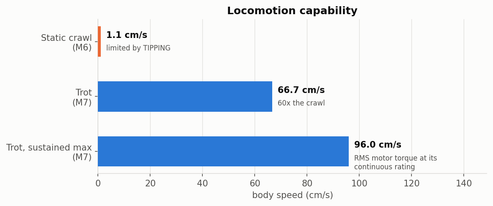
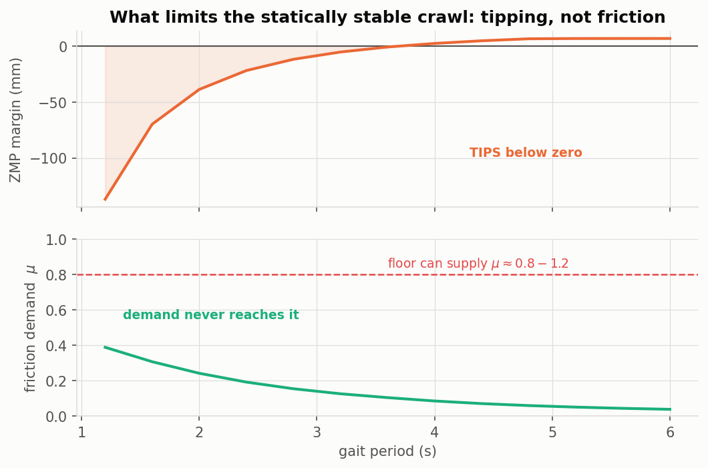
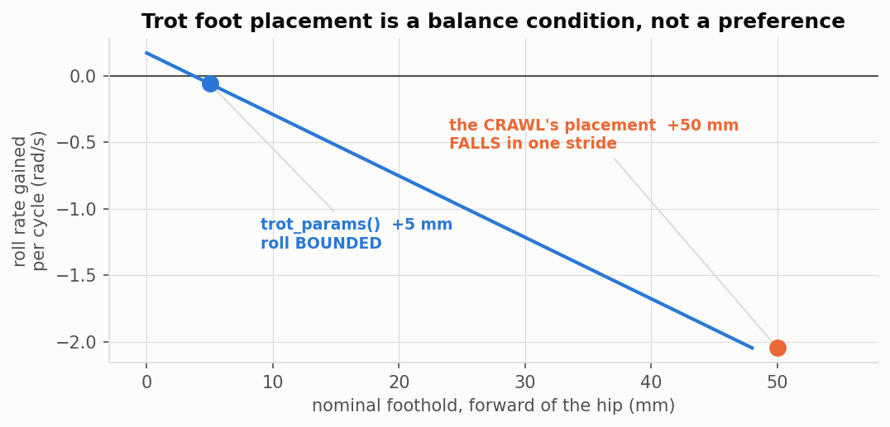
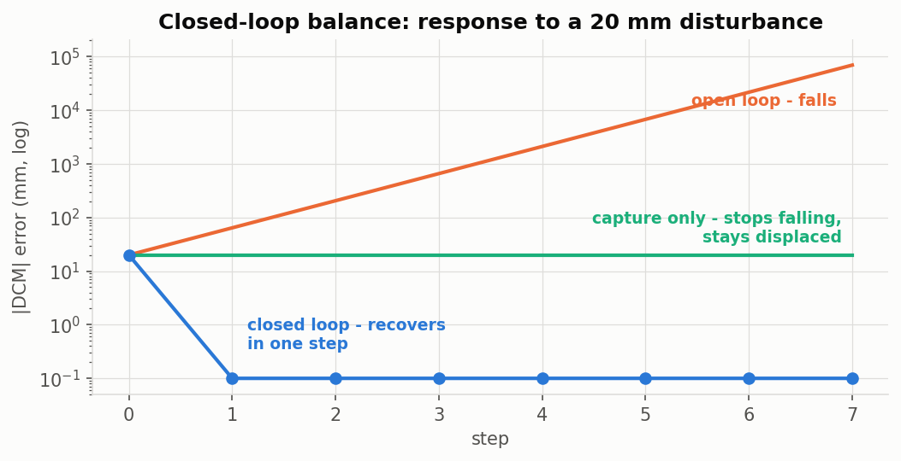
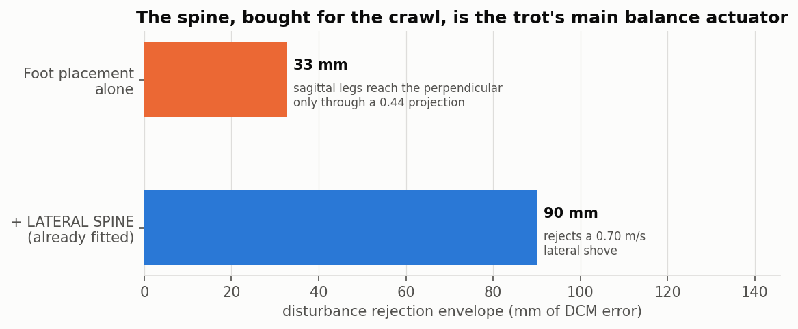

# Project T.O.M.C.A.T.

**Tendon-Operated Mechanism for a Compliant Actuated Tomcat**

A community-driven, open quadruped robot that uses synthetic cables (tendons)
pulled by rotary motors instead of a rigid gear/actuator at every joint. This
biomimetic design mimics feline musculoskeletal structure to provide flexible,
cat-like agility, energy-efficient movement, and passive shock absorption.

> The name is a backronym: **T**endon-**O**perated **M**echanism for a
> **C**ompliant **A**ctuated **T**omcat — advanced in intent, community-driven
> in spirit.

## Progress

Ten milestones in. The model now spans kinematics → real mass → 3D static
stability → whole-body dynamics → a dynamic gait → closed-loop balance, with
**299 passing tests** and every figure below generated from the live model
(`python tools/make_progress_figures.py`), so a published number cannot drift
from the code.

### Locomotion

Two gaits, and the gap between them is the story. The statically stable crawl is
a **1.1 cm/s** shuffle; the diagonal **trot reaches 67 cm/s**, sustainable to
96 cm/s before the worst motor's RMS torque hits its continuous rating. A
domestic cat trots at roughly 1 m/s.

### Why the crawl is slow — and it is not what we first thought

An earlier milestone concluded that **friction** capped the walk and demanded a
paw with μ ≥ 0.70. Resolving the per-foot ground-reaction forces showed that was
wrong: the friction demand never approaches what a floor can supply. What
actually fails is **tipping** — the zero-moment point leaves the support polygon.
The requirement was withdrawn.

### The trot: foot placement is a balance condition

Two diagonal contacts cannot produce a moment about the line joining them, so the
CoM's offset from that line is an *unbalanceable* topple. Whether it averages to
zero over a cycle decides everything: at the crawl's foothold the robot gains
2.1 rad/s of roll every cycle and falls inside one stride; 45 mm further back the
roll is a bounded ±0.4° rock. That rocking *is* the gait.

### Closed-loop balance

The trot is an inverted pendulum: any deviation is multiplied **3.2× every step**.
Balance is closed not by tracking harder but by choosing where to put the next
foot — placing it *beyond* the divergent component of motion, by a factor of 1.45.
Placing it merely *at* the DCM (green) arrests the topple but leaves the body
permanently displaced: stable, and walking away sideways.

### Where the balance authority comes from

The DCM lives *perpendicular* to the diagonal, and that direction is ~90 %
**lateral** — where sagittal-only legs are weakest. The articulated spine, added
for the *crawl's static stability*, turns out to be the trot's dominant **dynamic**
balance actuator, roughly tripling the envelope. Leg abduction (+4 motors, 528 g)
was re-examined against this and found **unnecessary**.

### The machine

| | |
|---|---|
|  |  |
| Digitigrade legs, fore/hind asymmetry, articulated spine, ribcage | 19 motors in three clusters, tendon routing, joint pulleys |

**19 motors, 4.05 kg.** The mass target rose from 3.0 kg when a real motor was
sourced: the lightest purchasable part meeting the torque is 132 g, not the 72 g
class target the budget had assumed. A domestic cat is 4–5 kg.

### Milestones

| | Milestone | Outcome |
|---|---|---|
| M1–M3 | Whole-body kinematics, gait, spine↔foot loop | digitigrade legs, articulated spine, closed loop |
| M4 | Real mass, CoM, fore-aft stability | mass model bottom-up from hardware |
| M5 | Lateral spine DOF | 3D support polygon; static stability recovered |
| M6 | Whole-body dynamics | **overturned M5** — tipping binds, not friction |
| M7 | The trot | **67 cm/s**; found a C¹ defect in the foot trajectory |
| M8–M10 | Closed-loop balance | rejects a **0.70 m/s** shove; spine is the key actuator |

Full detail in the [roadmap](docs/ROADMAP.md) and the [ADR log](docs/DESIGN_DECISIONS.md).

> **On the numbers.** Several milestones corrected the one before it — the M8
> envelope was overstated 2.3× by using an unprojected reach; M9 then under-counted
> the spine by clamping it with a *requirement* rather than its *capability*. Those
> corrections are recorded in the ADRs rather than quietly edited away, because the
> reasoning is the deliverable as much as the number is.

## Why tendon-driven?

Placing motors at each joint makes limbs heavy and increases rotational inertia,
which hurts agility and impact tolerance. By relocating the motors into the body
and routing tendons to the joints, TomCat keeps the limbs light and compliant —
much like biological muscle and tendon.

| Property            | Direct-drive joints | Tendon-driven (TomCat) |
|---------------------|---------------------|------------------------|
| Limb inertia        | High                | Low                    |
| Shock absorption    | Rigid               | Compliant (cable/spring)|
| Motor placement     | At each joint       | Centralized in body    |
| Backdrivability     | Poor                | Good                   |
| Control complexity  | Lower               | Higher (coupled cables)|

## Repository layout

| Path            | Contents                                                      |
|-----------------|---------------------------------------------------------------|
| `docs/`         | Requirements, system architecture, design decisions, glossary |
| `electronics/`  | KiCad schematics and PCB (control board, motor drivers)       |
| `firmware/`     | Embedded control firmware (motor/tension loops, gait)         |
| `kinematics/`   | Joint & cable kinematics models, gait planning, simulation    |
| `mechanical/`   | CAD, tendon routing, joint geometry, BOM                      |
| `tools/`        | Scripts for build, calibration, and analysis                  |
| `tests/`        | Unit and hardware-in-the-loop tests                           |

## Design principles

1. **Tendon-driven, centralized multi-motor actuation** — every joint, in the
   limbs *and the spine*, is pulled by cables from body-mounted motors; no motor
   sits at a joint.
2. **Feline form: the whole body may curve** — the torso is an articulated,
   tendon-driven spine, so the body arches, bends, and twists like a real cat.

See [docs/PRINCIPLES.md](docs/PRINCIPLES.md) for the full statement.

## Documents

- [Design Principles](docs/PRINCIPLES.md)
- [Requirements](docs/REQUIREMENTS.md)
- [System Architecture](docs/ARCHITECTURE.md)
- [Design Decisions (ADR log)](docs/DESIGN_DECISIONS.md)
- [Literature Review](docs/LITERATURE_REVIEW.md) — deep, cited synthesis of prior art
- [Related Work & References](docs/REFERENCES.md) — raw source index
- [Sub-Agent Team](docs/TEAM.md) — specialist agents + coordinating lead
- [Glossary](docs/GLOSSARY.md)

## Status

**Modelling and design.** No hardware built. Every result above comes from the
`tomcat_kin` model with its assumptions stated in-line; the largest open items are
a real motor purchased and weighed, a paw drop-test, and bench-identified tendon
friction. See [REQUIREMENTS.md](docs/REQUIREMENTS.md) for the open questions.
