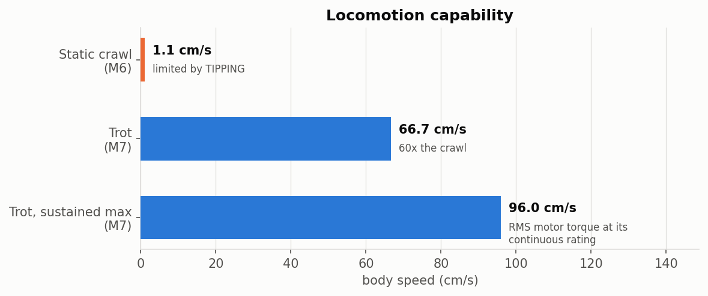
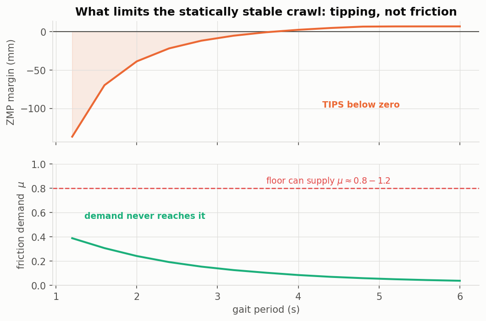
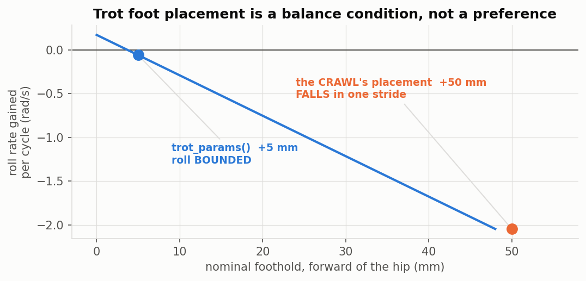
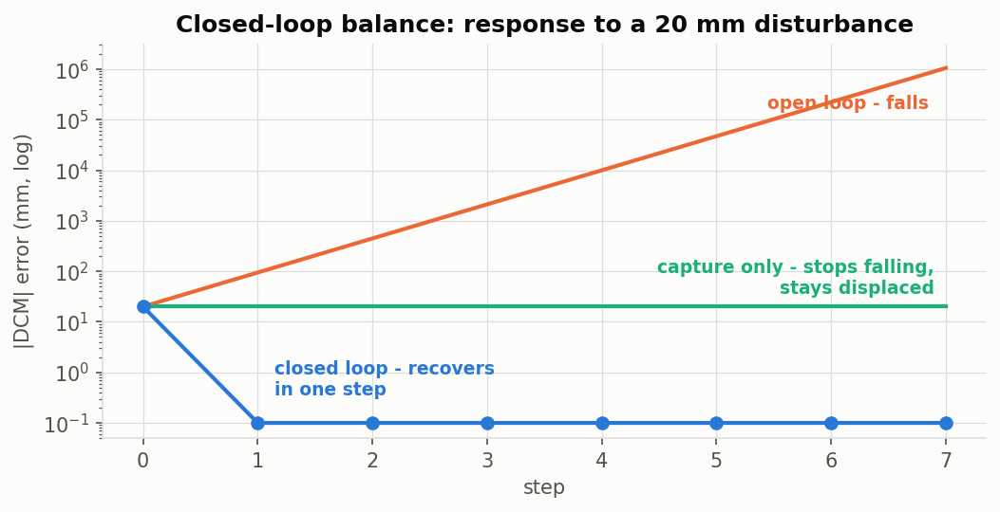
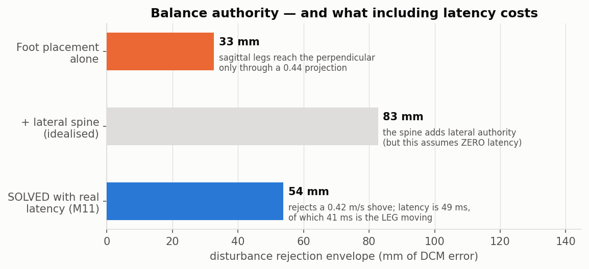
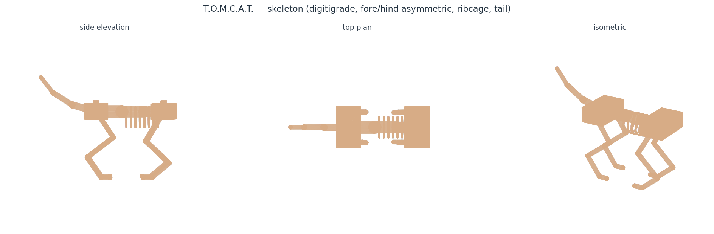
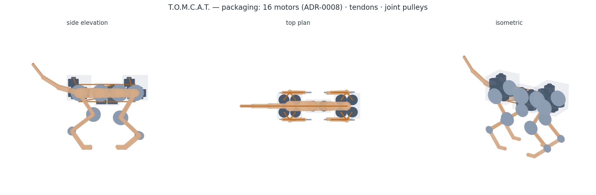
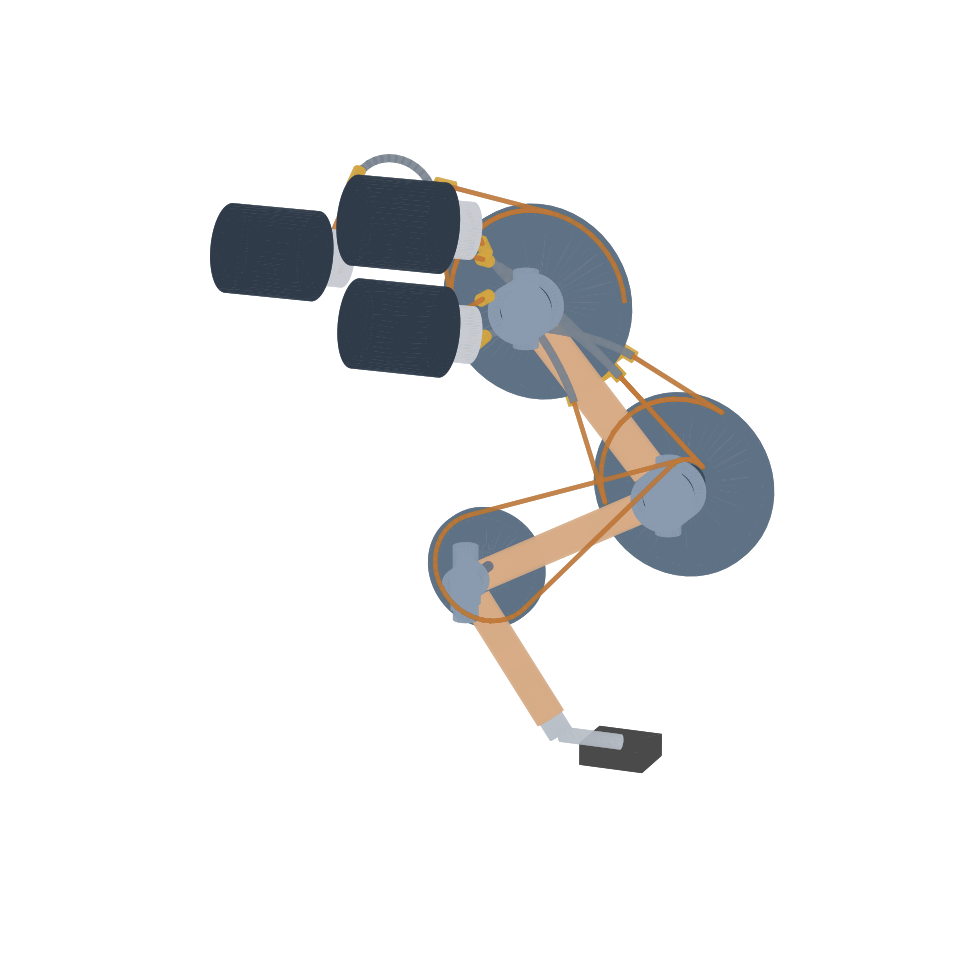

# Project T.O.M.C.A.T.

**Tendon-Operated Mechanism for a Compliant Actuated Tomcat**

A community-driven, open quadruped robot that uses synthetic cables (tendons)
pulled by rotary motors instead of a rigid gear/actuator at every joint. This
biomimetic design mimics feline musculoskeletal structure to provide flexible,
cat-like agility, energy-efficient movement, and passive shock absorption.

> The name is a backronym: **T**endon-**O**perated **M**echanism for a
> **C**ompliant **A**ctuated **T**omcat — advanced in intent, community-driven
> in spirit.

## Progress

Seventy-four milestones in. The model now spans kinematics → real mass → 3D
static stability → whole-body dynamics → a dynamic gait → closed-loop balance →
an independent physics-engine cross-check → thermal duty → whole-body force
allocation, with **493 passing + 5 suspended Python tests and 17 Rust** and every figure below
generated from the live model (`python tools/make_progress_figures.py`), so a
published number cannot drift from the code.

### Locomotion

Two gaits, and the gap between them is the story. The statically stable crawl is
a **1.1 cm/s** shuffle; the diagonal **trot reaches 50 cm/s** — slowed from 67 because the spine's
balance assist has to push against the ground, and that demand scales as
1/stance². The motors would allow ~96 cm/s on a better floor. A
domestic cat trots at roughly 1 m/s.

### Why the crawl is slow — and it is not what we first thought

An earlier milestone concluded that **friction** capped the walk and demanded a
paw with μ ≥ 0.70. Resolving the per-foot ground-reaction forces showed that was
wrong: the friction demand never approaches what a floor can supply. What
actually fails is **tipping** — the zero-moment point leaves the support polygon.
The requirement was withdrawn.

It came back for a *different* mechanism. Bending the spine to balance is **internal**
motion, so shifting the CoM against planted feet is paid for in ground reaction
(ADR-0019/0020). Re-derived on the exact viable set, NFR15 is met from **μ ≥ 0.6**
— a margin, not a knife edge (ADR-0034).

### The trot: foot placement is a balance condition

Two diagonal contacts cannot produce a moment about the line joining them, so the
CoM's offset from that line is an *unbalanceable* topple. Whether it averages to
zero over a cycle decides everything: at the crawl's foothold the robot gains
2.1 rad/s of roll every cycle and falls inside one stride; 45 mm further back the
roll is a bounded ±0.4° rock. That rocking *is* the gait.

### Closed-loop balance

The trot is an inverted pendulum: any deviation is multiplied **3.2× every step**.
Balance is closed not by tracking harder but by choosing where to put the next
foot — placing it *beyond* the divergent component of motion, by a factor of 1.45.
Placing it merely *at* the DCM (green) arrests the topple but leaves the body
permanently displaced: stable, and walking away sideways.

### Where the balance authority comes from

The DCM lives *perpendicular* to the diagonal, and that direction is ~90 %
**lateral** — where sagittal-only legs are weakest. The articulated spine, added
for the *crawl's static stability*, turns out to be the trot's dominant **dynamic**
balance actuator.

Solving the loop with **real latency and the actuation ramp** brings it to
**53 mm** (a 0.41 m/s lateral shove): latency is not an independent parameter,
because a bigger correction takes the leg longer to execute and *that* is the
staleness the controller acts on. Of the ~48 ms total, **41 ms is the leg moving**
— so the electronics is comfortably *not* the bottleneck, and foot speed is the
lever.

That 53 mm is now checked against a **stated requirement** rather than quoted as a
capability: a 15 N push (48 mm), a 40 mm unexpected step, and a 10° lateral slope,
met with ~10 % margin. A hard 30 N shove is explicitly out of scope.

> The headline moved twice and both corrections are in the ADR log: **57 mm** was
> quoted at a 0.3 s stance with the spine assist assumed free (ADR-0017); the trot
> then slowed to 0.4 s (**53.9 mm**, ADR-0020), and a CoM bug in the sway cost
> another 4 % (**52.72 mm**, ADR-0025).

### Achievable, and not yet achieved

The 53 mm above is what a *reduced-order model of one controller* achieves. Two
later milestones separate that from what the machine could do at all.

`viable.py` computes the **viable set** exactly — the disturbances *any* controller
could recover from — as a Minkowski recursion over the reachable centre-of-pressure
polygons. It removes the controller from the question:

| | worst direction |
|---|---|
| Viable set, feet only — **any** controller | **29.8 mm** |
| Reduced-order model, feet only | 30.3 mm |
| Closed-loop MuJoCo harness, **survived** | 25.6 mm |
| Closed-loop MuJoCo harness, **recovered** | **1.5 mm** ⚠️ |
| Viable set, **+ spine** | **62.7 mm** |
| **NFR15 requires** | **48.0 mm** |

Two things follow, and they point in opposite directions. **The reduced-order model
was never optimistic** — feet-only it is within 2 % of the exact limit. But **the
spine credit is not being spent**: four independent attempts to give the controller
that authority (reactive spine, planned spine, direct CoP, load split) each made the
loop *worse*.

> ⚠️ **M35 corrected the third row of that table, and it matters.** The 25.6 mm the
> controller "achieves" is a **survival** figure — the trial passes if the robot does
> not fall inside the horizon. The viable set is a **recovery** bound. Compared
> like-for-like, the shipped controller ends its certified 25.6 mm trial **26.2 mm
> off its support**, and its recovery envelope is **1.5 mm**. The often-quoted
> "**86 % of optimal**" was survival measured against recovery, and is withdrawn.
> The cause is diagnosed — the placement law has no term that removes a *persistent*
> offset, so it settles into a biased limit cycle — which makes it the first concrete
> control defect this arc has produced rather than another dead end.

So NFR15 is **achievable but not demonstrated**, and the gap is a control problem
with a proven target rather than a missing actuator. M33 started the answer from the
other end — `wbc.py` allocates **contact forces** inside the friction cones, making
the ground reaction a decision instead of a consequence of where the foot was put.
Its by-product is the quantity every earlier attempt lacked: a **“step now”
residual**, the distance by which the demanded centre of pressure falls outside the
support *line* a diagonal stance actually has.

M34 spent that residual on step **timing** — and found something more useful than a
fifth failure. Re-timing does read +24 %, but a *fixed* shorter stance beats the
clever trigger outright (37.7 against 31.7 mm), and the harness's own undisturbed
drift doubles exactly where the gains appear. So the measurement, not the controller,
ran out first — and M35 went to fix the instrument.

It did fix it: the drift is loop gain, not plant, and one constant detune flattens it
across the whole stance range. Then the flattened harness certified **42.2 mm against
a 39.5 mm exact bound** — an impossibility, and the thread that unravelled the
criterion above. That contradiction is still standing, deliberately: whichever way it
resolves, either the viable set that declared NFR15 achievable or the simulation
every envelope rests on is wrong. **That is the next milestone.**

### The machine

| | |
|---|---|
|  |  |
| Digitigrade legs, fore/hind asymmetry, articulated spine, ribcage | 19 motors in three clusters, tendon routing, joint pulleys |

**19 motors, 4.31 kg — and 58 % of that is motor.** The mass target has risen
twice, both times because something assumed turned out to be purchasable: 3.0 →
**4.05 kg** when a real motor was sourced at 132 g rather than the 72 g class
target (ADR-0010), and 4.05 → **4.31 kg** when the leg was drawn as manufacturable
parts and came out 167 g rather than 110 (ADR-0043). A domestic cat is 4–5 kg, so
the target is not physically wrong — it is just no longer the number.

Reviewed on spec at that mass (ADR-0044), the motor **holds**: trot at 88 % of
peak, and a thermal duty of 0.64–0.81× the continuous current rating, which closes
the sharpest open item in the actuator story. Two things do not. **NFR6's runtime
falls to 14–20 min** from a published ~30. And the vendor's three published numbers
— rated pair, peak pair, and quoted Kt — **disagree by 27 %**. The down-select
re-run also loses a candidate: the smaller GIM3505-8, previously listed as meeting
the requirement, is now over its peak.

Chasing that 27 % was worth it. It is **not** a rotor-side figure — that reading is
7.1× off and in the wrong direction. What fits within 0.4 % is a six-step-versus-
sinusoidal current convention, in which case *both* vendor numbers are right and
only the driver's current sense decides which to use.

And digging turned up something firmer alongside it, which became M40: `power.py`
computed copper loss as `I²R_pp` where balanced three-phase is `3I²R_ph`, i.e.
**1.5× more**. Its own docstring had flagged the simplification since M16 and
justified it as matching the down-select note "so the two agree" — they agreed on a
figure 1.5× low. That correction is arithmetic: no purchase, no email.

Corrected, the drive is **29.6 % efficient** rather than 39, and copper loss is
**2.4× the useful mechanical work** — which sharpens ADR-0021's own argument rather
than weakening it. ⚠️ But it **overturns the thermal headline**: ADR-0023 concluded
that an anodised girdle is safe on its own ~75 °C equilibrium rather than because the
battery dies. That equilibrium is **96.1 °C**. Anodising is worth *more* than before
(59 K, not 39, since radiation goes as T⁴) and is **no longer sufficient** — forced
air moves from an option to a requirement.

### One leg, drawn as parts

The skeleton above is a *massing* model; this is the other kind. Bonded aluminium
inserts with a modelled glue line, clevis joints with H7 bearing bores and h6
shafts, turned sheaves whose groove pitch line **is** the tendon moment arm the
kinematics model uses — so the CAD cannot drift from the torque budget. STEP and
STL, from `python mechanical/cad/tomcat_leg_detail.py`.

The copper runs are the tendon drive itself — five cables from three girdle motors,
over concentric via-pulleys, wrapping each sheave and terminating on anchor pins.
**That is the P1 argument as a measured number: 395 g of motor stays in the girdle,
and the cable that carries its 600 N into the limb is 3.3 g of UHMWPE.**

⚠️ **It does not close.** Drawn as real parts the leg is **168 g against a 110 g
allowance**, and the picture shows why: the sheaves *are* the leg. They cannot
shrink either — at the specified moment arms the trot case is already 81 % of motor
peak, and 0.85× the arms exceeds 100 %. The overrun is +200 g across four legs, so
**NFR5's 4.05 kg is flagged at risk.**

⚠️ **And the tendon map is wrong.** Routing a tendon past a joint needs a via-pulley,
and its wrap changes with the proximal angle — so the pulley couples the joints by
its own radius per radian. Measured, the off-diagonals are exactly **±8.75 mm/rad**:
**35 %** of the knee's own moment arm and **62.5 % twice** for the ankle.
`TendonMap.cable_lengths` puts them at zero. It cannot be designed away either —
8.75 mm *is* the cable's minimum bend radius. Priced, it raises the knee tendon
**+39.5 %** (435 → 607 N, SF 4.94 — still clearing 4).
[ADR-0042](docs/DESIGN_DECISIONS.md) / [ADR-0043](docs/DESIGN_DECISIONS.md).

⚠️ **And the sharpest finding is about P1 itself.** Leg swing inertia comes out
**+61.7 %**, because the joint hardware sits *along* the limb rather than in the
body — the metatarsus more than doubles. `link_mass` justifies its proximal-heavy
distribution by saying the tendon drive pushes mass toward the body; **it pushes the
motors there, not the pulleys.** ADR-0003 accepted the entire cable-tension burden
to buy low limb inertia, and the sheaves take most of it back.

That said, it does *not* cascade: the balance envelope moves only 52.7 → 51.9 mm,
because the swing is speed-limited rather than acceleration-limited — which M12 had
already established. The finding is real and its downstream cost is small.

The pass also found that **LEG_TENDON_SPEC §1.1 has been stale since ADR-0010** — it
still carries the 3.0 kg body's torques (hip land 12.36 N·m against the live
16.67 N·m), and the link sizing derived from it claims SF 2.84 where the real number
is **1.97**. That remedy *is* cheap: one step up in stock tube, under 4 g.
[ADR-0041](docs/DESIGN_DECISIONS.md).

### Milestones

| | Milestone | Outcome |
|---|---|---|
| M1–M3 | Whole-body kinematics, gait, spine↔foot loop | digitigrade legs, articulated spine, closed loop |
| M4 | Real mass, CoM, fore-aft stability | mass model bottom-up from hardware |
| M5 | Lateral spine DOF | 3D support polygon; static stability recovered |
| M6 | Whole-body dynamics | **overturned M5** — tipping binds, not friction |
| M7 | The trot | **67 cm/s**; found a C¹ defect in the foot trajectory |
| M8–M10 | Closed-loop balance | DCM foot placement; spine is the key actuator |
| M11 | Latency budget | the leg, not the electronics, is the limit |
| M12 | Ramp + requirement | envelope checked against a *stated* disturbance spec |
| M13–M15 | Full rigid-body terms | the spine assist costs **friction**; trot slows to 50 cm/s |
| M16–M17 | Power, runtime, independent engine | NFR6 closed; MuJoCo says LIPM is ~2 % **conservative** |
| M18–M19 | Thermal duty (Rust) | the **battery** is the thermal protection — and that is a coincidence |
| M20–M23 | Balance in simulation | the envelope is **direction-dependent**; earlier readings were taken before the limit cycle |
| M24–M27 | Four ways to spend the spine | reactive, planned, CoP, load split — **all four make it worse** |
| M28 | The viable set, exactly | NFR15 is **achievable**: 62.7 mm available against 48 mm required |
| M29–M31 | Stale tables, friction, horizon | μ ≥ 0.6 suffices; the spine's friction cost is ~14 %, not ~100 % |
| M32 | The last degree of freedom | the feet-only controller is at **86 % of optimal** — the gap is the spine |
| M33 | Whole-body force allocation | torque control makes contact force a **decision**; a diagonal stance has no support polygon |
| M34 | Step timing | the **fifth** DOF to fail — and the first where the *harness* is what fails |
| M35 | The instrument | the harness measures **survival**; the bound it was checked against measures **recovery** |
| M36 | The leg, drawn as parts | manufacturable geometry — and the leg is **146 % of its mass allowance** |
| M37 | The tendon drive, routed | the tendon map is **coupled** where the model says it is diagonal |
| M38 | The mass spiral, closed | **4.30 kg** — NFR5 breaks, nothing else does, P1 gives back 62 % |
| M39 | The motor, on spec | it holds; **NFR6's runtime does not**, and the vendor's own numbers disagree 27 % |
| M40 | The copper-loss formula | it was **1.5× low** — correcting it overturns the thermal headline |
| M41 | The fold-in | **4.30 kg is now the model** — and it cost five findings |
| M42 | Built as a tendon drive | the cable is **5× too stiff**, and G3 finally has a number |
| M43 | The whole body, 18 DOF | it **leans rather than collapses** — and four M42 numbers were measured on a leg pointing the wrong way |
| M44 | It **stands** | foot-force allocation holds it to **0.006°** — and a lone tendon's moment arm **reverses inside its own ROM** |
| M45 | The ankle takes a **pair** | ADR-0002 settled after four milestones — on **kinematic reach**, the one cost nobody had priced |
| M46 | A **spool** behind every cable | the drivetrain is exact — and adding the missing DOF exposed a **missing controller** |
| M47 | The drivetrain **cascade** | derived, not tuned — and a **firmware gain** sets how much of a mechanical spring you get |
| M48 | The **fore leg was never mirrored** | five milestones measured one leg and generalised — and **three control findings retract** |
| M49 | **Only the ankles** were validated | a check at one operating point is not a check — hip and knee fail on **both** legs |
| M50 | **Clamp the cable** to the sheave | a resting wrap has a working window; a clamped capstan does not — and that explains everything since M42 |
| M51 | Housekeeping, mostly **blocked** | the simulation never implemented the **variable-radius pulley** — 1.05 kg of unbudgeted motor |
| M52 | The **clamped transmission** | exact on both legs at every angle — and two accepted ADRs want **different robots** |
| M53 | **ADR-0008 wins** | one motor per pair — 12 motors, 4.30 kg, and the standing tension **stops saturating** |
| M54 | The **re-derivation** | the shipped plant is the default — and **eight tests had stopped being able to fail** |
| M55 | The **cascade**, re-derived | the gains transfer unchanged — the cost was **headroom**, and a step command is not a test |
| M56 | The profile, **priced and declined** | the one joint that needs help has **no shape to exploit** |
| M57 | The **articulated spine** | 18 of 19 DOF and it **stands** — the sagittal axis had never been in any model |
| M58 | The sway, **on the real plant** | 6 % of what was designed, every paw slides — two ADRs want **different robots** |
| M59 | The **foot was not a foot** | 8.3 mm of silent contact error — and **five published results** moved |
| M60 | The arm buys **cost, not sway** | triple the moment arm, identical motion — the gap is **control** |
| M61 | **No frontier** | one gain pair stands — and it buys **4 %** of the sway |
| M62 | Static stability is **already gone** | the achieved sway recovers **3.9 %** — a factor of twenty short |
| M63 | **Righting**, measured | a factor of **five** short — and the DOF it was specified on **does not exist** |
| M64 | The **designed manoeuvre** | **+49 %**, not 5× — and the cat's own pattern is the optimum |
| M65 | It **rights itself** | in 2.14 s — a fall from **22.5 m** — and the axial DOF makes it worse |
| M66 | **G6 withdrawn** | 22.5 m is not a realistic fall — NFR2c now **met** at 18 DOF |
| M67 | What a **fall** costs | it cannot be answered — the whole body has **no G3**, and the spine's stops go first |
| M68 | The whole-body **drivetrain** | G3 takes the **cable** from 223 N saturated to 84 — and does nothing for the ground |
| M69 | The margin, re-measured | the mode halves and the margin **improves** — a posture term is affordable |
| M70 | Sway and righting, re-checked | the sway does not care about G3; the righting takes **4.7× as long** through a compliant spine |
| M71 | The spine's **drivetrain** | G3 on all 18 cables — and ADR-0073's cable margin turns out to be a **rigid-trunk** result |
| M72 | The plant an agent would **train in** | MJX is viable; `nsensor` was **0**, there is no joint encoder, and the ankle load cell is worth **6°** |
| M73 | The control **rate**, and NFR12 | the allocation is rate-insensitive, the **joint PD** is not — and NFR12's 7.5 ms **holds** |
| M74 | **Throughput**, answered | **262,678 steps/s** on the 4090 already in the machine — training is affordable |

Full detail in the [roadmap](docs/ROADMAP.md) and the [ADR log](docs/DESIGN_DECISIONS.md).

> **On the numbers.** Several milestones corrected the one before it — the M8
> envelope was overstated 2.3× by using an unprojected reach; M9 then under-counted
> the spine by clamping it with a *requirement* rather than its *capability*. Those
> corrections are recorded in the ADRs rather than quietly edited away, because the
> reasoning is the deliverable as much as the number is.

> ### ⚠️ M41: the fold-in, and what it cost
>
> M36–M40 measured what the numbers should be and deliberately left `params.py`
> alone, because *every mass-derived published figure moves with it*. M41 made the
> move — six parameters — and the consequences are the honest headline of this
> project right now.
>
> **The trot foothold had to be re-tuned.** At the old value the roll drift is
> −0.180 rad/s per cycle: divergent, the robot falls inside a stride. The balance
> point is a property of where the CoM sits, so it moved with the leg masses.
>
> **Runtime 30.2 → 18.78 min. Drive efficiency 38.7 → 25.8 %.** Anodised girdle
> continuous **119 °C**, and the forced air that used to recover it (h = 15) no
> longer does — only h = 25 brings it under 80.
>
> **And five earlier findings are suspended rather than retuned.** The closed-loop
> survival measurement went degenerate — 37.17 mm in *both* test directions, above
> the 29.15 mm exact viable bound — which is exactly what M35 said would eventually
> happen, because survival was never the quantity the bound describes. Four tests
> reading it, plus ADR-0029's proportional-spine finding (whose direction inverted),
> are marked `xfail(strict=True)`. Fitting new thresholds to an instrument this
> milestone just showed to be broken would be the M35 mistake made twice.
>
> What survived is worth saying too: every design gate still passes, the
> reduced-order model's 2 % agreement with the exact viable set survived the mass
> change, and compliant legs still beat stiff ones.
> [ADR-0046](docs/DESIGN_DECISIONS.md).

> ### ⚠️ M42: the simulation was not a tendon drive
>
> The plan is to build the robot in simulation before hardware. The first thing that
> needed establishing is that **the simulation was not the robot.** `mjcf.py` puts a
> `<position>` servo on every joint, so the plant under every balance result since
> M17 has been a **direct-drive** machine — and a position servo can *push*. "A cable
> can only pull" is a premise of three ADRs; the simulation never had it.
>
> Built properly — five spatial tendons per leg over real sheaves, pull-only
> actuators — two things came out. **ADR-0042's joint coupling is emergent**, matching
> a hand derivation to three decimal places from the geometry alone. And the
> headline: **the cable is 5× stiffer than balance can tolerate.** ADR-0026 measured
> that balance needs compliant legs (kp 80–150 N·m/rad) and falls at kp ≥ 250; the
> cable gives the hip **1304**. That requirement was on hardware nobody had built.
>
> ✅ So **design goal G3 finally has a number**: a **~175 kN/m** series-elastic
> element at the hip and knee, which is the first target it has had since M1.
> ⚠️ And the ankle fails the other way — a cable always pulls the same direction, so
> a single-tendon joint has *no* restoring stiffness, which is a cost ADR-0002's
> Option B never counted. [ADR-0047](docs/DESIGN_DECISIONS.md).

> ### ⚠️ M43: the whole body leans, and M42 was measured on a leg pointing up
>
> Four tendon-driven legs on a floating trunk: 18 DOF, 20 pull-only tendons,
> 4.3081 kg against the model's 4.3041.
>
> ⚠️ **The M42 leg's hinge axis was wrong.** `LegModel.forward` requires
> `axis="0 -1 0"`; `mjcf_tendon.py` used `(0, 1, 0)`, so the leg pointed **up** —
> feet at z = +0.346 above a trunk at 0.176. Correcting it left the cable on the
> wrong side of every via-pulley, and **nothing complained**: the knee flexor's
> moment arm read **1.17 mm/rad instead of 25.10**. A wrap that does not happen is
> not an error condition. It moved four published numbers and **retracted one M42
> finding**. ⚠️ What let it hide was a test harness with the Jacobian **written
> down as a literal** — after the fix it commanded the wrong antagonist and the leg
> collapsed 102° while the routing was fine.
>
> ✅ **What the repair could not move: the ×8.75 mm/rad coupling.** -8.750 before
> and after, while diagonal signs flipped and every cable length changed. That is a
> stronger confirmation of ADR-0042 than M42's agreement was — an **invariance**,
> not a coincidence. G3's ~175 kN/m survived too, and gained a **125-175 kN/m band**.
>
> ⚠️ **The gate: it does not stand, and the failure is a LEAN.** Welded to the
> world every leg holds (hind 0.37°, fore 1.8-2.3°). Floating, it settles at
> **85 % of target height, tilted 14.5°, on two feet of four** — while every leg
> holds its angles. **Exactly the diagonal-stance problem M33 named:** nothing in a
> per-leg loop has an opinion about the trunk. Commanding joint *angles* cannot say
> "put 10 N more through the left front foot"; commanding foot *forces* can, and
> `wbc.py` already does. [ADR-0048](docs/DESIGN_DECISIONS.md).
> ⚠️ **M44 retracted the 14.5° figure** — two more routing defects were inflating
> it, and corrected the joint controller reaches 2.4°. The diagnosis held; the
> measurement did not.

> ### ✅ M44: it stands — and a lone tendon reverses on itself
>
> Twenty cables that can only pull, a floating trunk, and `wbc.py`'s foot-force
> allocation driving it: trunk height held to **0.21 mm** over 3 s, trunk tilt
> **0.006°**, four feet down. **M43's gate is closed.**
>
> It needed one missing link — joint torque to *non-negative* tendon tension,
> written out as Lawson-Hanson NNLS because firmware will not have scipy either —
> and three fixes in already-published code. ⚠️ Clipping instead of solving
> escalated from ADR-0047's *"about a degree"* to **197° of hip drift**.
>
> ⚠️ **The structural finding: a lone tendon's moment arm reverses sign inside its
> own ROM.** Swept 12 anchor angles across the full ankle range, **all 12 reverse**
> — and they must, since a metatarsus sweeping 180° drags its anchor 180° around
> the sheave and the cable line has to cross the centre once. The hind hock stands at
> **+97.1°** and the reversal sat at 85°, so **the hind ankle could not hold a
> stance at any tension**. That is a sharper statement of what ADR-0002 Option B
> costs than *"no restoring stiffness"* was: the one direction it can pull is not a
> fixed direction in joint space.
>
> ✅ **And G3 is confirmed twice over.** ADR-0047 sized the series-elastic element
> from balance compliance; here it is what makes the robot stand at all — at
> 175 kN/m it holds 0.006°, with the bare cable it **inverts**.
> ⚠️ Not sustainably, though: the hind hip extensor runs **~205 N to stand still**
> against a motor rated 81 N continuous. [ADR-0049](docs/DESIGN_DECISIONS.md).

> ### ✅ M45: the ankle takes an antagonistic pair, decided on reach
>
> ADR-0002 chose **one tendon plus a return spring** for the ankle, on motor count.
> Four milestones then priced it: no restoring stiffness (M42), a moment arm that
> **reverses inside its own ROM** (M44), and finally the cost nobody had looked at.
>
> ⚠️ **"Add an antagonist" is not sufficient.** Mirroring the pair the way the hip
> and knee do it leaves a **60° band where both cables pull the same way** — with
> the stance hock inside it. It has to be a **capstan**: both cables to one anchor,
> opposite wraps, so they **reverse together and stay opposite**. A construction that
> works at one joint is not a construction that works at every joint.
>
> ✅ **And most of the evidence favoured the cheap option.** A spring 27× stiffer
> holds the unloaded ankle to **-0.58°** with no extra motors, and the trot only
> needs 8.6° of travel in the tendon's own direction — 2.9× margin.
>
> ⚠️ **Then the gait was asked.** It commands the ankle **+62.4° above its
> reference during SWING**, and under Option B **nothing pulls that way**: the tendon
> pulls down, the spring pulls toward the reference. In stance the ground supplies it;
> in swing the foot is unloaded and there is nothing left.
>
> So: **Option A, capstan** — four motors, **+528 g, a projected 4.83 kg**, 19 → 23
> actuators. It is the only option measured that can command the gait this project
> already publishes. ⚠️ Two limits kept in view: the pair's *travel* cannot be
> measured here (no spool DOF, so a slack antagonist acts as a spring — 273.8 N
> against the 222.9 N driving it), and the standing-tension comparison is confounded
> by a missing posture task. Neither touches the argument, which is kinematic.
> [ADR-0050](docs/DESIGN_DECISIONS.md).

> ### ✅ M46: a spool behind every cable, and what it exposed
>
> ADR-0050 could not measure an antagonistic pair's **travel**, because a motor
> could not **pay cable out** — a slack antagonist acted as a spring and stalled the
> ankle at 8.9°. Every cable now has a real drivetrain: *motor → rotor → series
> spring → spool → cable*.
>
> ✅ **The statics are exact** — pin the leg and the spring carries the whole motor
> torque to five decimal places, landing on the same **222.9 N** ceiling M43 asserted,
> now *derived*. ✅ **And pay-out works**: the antagonist unwinds by exactly `r*theta`
> and the driven tendon reaches its end stop, **127°** against 8.9°.
>
> ⚠️ **Then adding the missing degree of freedom exposed a missing controller.** With
> the actuator on the rotor rather than the tendon, commanding a tension is no longer
> instantaneous — it arrives through a **120 Hz** series-elastic mode, and *every*
> controller this project has commands tension directly. The loop that holds the old
> plant to 0.00° leaves 5–10° here. ⚠️ It is not numerical: refining the timestep
> 20× changes it by under 2 %. A motor at zero torque on a near-inertialess spool
> really does spin at hundreds of rad/s, so driving one motor open-loop with the rest
> at zero is not an experiment a tendon robot can perform — which is why no travel
> figure beyond the end-stop case is published.
>
> Four quiet modelling traps are recorded with it, including the one that cost most:
> a tendon equality is referenced at **`qpos0`**, not at the state you set, so without
> the offset every cable starts centimetres out, the solver snaps the leg, and the
> residuals then sit **constant** — which reads like a satisfied constraint until you
> notice what they are constant at. [ADR-0051](docs/DESIGN_DECISIONS.md).

> ### ✅ M47: the cascade, derived rather than tuned
>
> M46 left the spooled plant undriveable. The cascade that fixes it is three pieces,
> each with a closed form: a rotor **position** servo (`kp = I·wn²`, because a real
> motor brings an encoder and a current loop), a command law that falls straight out
> of the winding constraint — and whose zero-tension reference reads off the state,
> so **no offset is needed at all** — and an exact droop compensation. It holds the
> stance pose to **0.00°** where M46's hand-tuned attempt left 5–10°.
>
> ⚠️ **And a firmware gain sets how much of a mechanical spring you get.** The
> servo's own stiffness sits in series with G3: at a 3000 rad/s rotor loop the
> drivetrain delivers **141 kN/m** of the 175 specified, and at **1000 rad/s only
> 95** — outside the band M45 handed to mechanical. The tension droop compensates
> exactly (−0.1 % at every gain, including one that was 36 % out); the delivered
> stiffness does not. **G3 cannot be specified without a servo bandwidth beside it.**
>
> ✅ **M45's open question is answered, qualified.** The antagonistic pair *does*
> reach the trot's ankle range — once M44's **moment-arm reversal** is moved out of
> it. On the shipped anchor the hind reversal sits **inside** the gait range and the
> cascade cannot cross it; move the anchor and the whole range tracks to **3.5°**.
> ⚠️ So the criterion used since M44 — reversal outside the *stance pose* — was too
> weak: it has to be outside the whole *gait range*, per leg, and the two legs need
> different angles because their hocks stand **81° apart**. M47 measured that
> migration and did not ship it: it re-derives 14 tests across three milestones.
> [ADR-0052](docs/DESIGN_DECISIONS.md).

> ### ⚠️ M48: the fore leg's routing was never mirrored
>
> M48 set out to land that migration. Applying it and measuring **both legs** — which
> no milestone had done, because every Jacobian since M42 was taken on the hind leg —
> turned up something larger. **The fore hip pair does not oppose**: +11.636 and
> +35.885 mm/rad, both positive, against a specification of ±28. The two cables pull
> the joint the same way and there is no antagonist. The knee and ankle couplings are
> as wrong, and the same numbers come out of the committed M47 tree, so **it has been
> true since M42**. It is what M43 flagged as "inherited rather than mirrored" and
> read as a tuning difference.
>
> ⚠️ **Three control findings retract on the migrated plant**, all consequences of an
> under-actuated ankle rather than of a control law: gravity feedforward *does* hold a
> pose (0.0001°, not divergence), clipping *does not* lose the leg (0.0002°, not
> 197), and **the bare cable does not invert the robot** (it stands at 0.07°). The
> last is the one that matters: M44 used it as an *independent confirmation of design
> goal G3*, and that confirmation does not survive. G3's balance-compliance argument
> stands — but it is one argument again, not two.
>
> ✅ What the migration does buy is recorded and not shipped: it **forces** the
> antagonistic ankle rather than preferring it (a lone tendon at the migrated anchor
> cannot stand at all), and the ankle finally clears ADR-0026's compliance floor at
> **86.3 N·m/rad**. Nothing lands until the fore leg is mirrored, because
> re-deriving 17 tests on a known-broken leg would bake the wrong numbers in.
> [ADR-0053](docs/DESIGN_DECISIONS.md).

> ### ⚠️ M49: a check at one operating point is not a check
>
> M49 set out to mirror the fore leg and began by applying M47's criterion — the
> pair must stay opposing, arms near specification, **everywhere the gait commands**
> — to all six routings. Nobody had done that for the hip or the knee.
>
> ✅ **Only the ankles pass.** They are also the only joints anyone ever swept
> against a range criterion. The hip and knee came from M42's 2-D heuristic and were
> checked **at the stance pose only**, and across the gait they fail on **both** legs:
> the hind hip goes same-sign at 6 of 13 sample points, the fore hip at 5, and the
> fore knee's arm is **23.8 mm out on a 25 mm specification**.
>
> ⚠️ So M48's diagnosis was too narrow. The fore leg is worse, but only because its
> stance pose sits **inside** its own failure band while the hind's sits outside —
> which is exactly why five milestones of stance-pose checks saw nothing.
>
> ✅ Three of the four bad routings have a measured fix (hind knee 75°, fore hip
> 135°, fore knee 285°). ⚠️ **The hind hip has none**: its gait range is 74.9°
> wide, 2.7× the fore hip's, and wider than the sheave construction's working window
> — no anchor angle, mirrored or capstan, and no spool offset fixes it. It needs a
> different construction, and it is now the critical path.
> [ADR-0054](docs/DESIGN_DECISIONS.md).

> ### ✅ M50: clamp the cable, and the window disappears
>
> A cable that merely **rests** on a sheave gives the sheave's radius only while it
> actually wraps. Across the hind hip's gait range the resting arm swings **21.0 to
> 36.3 mm on a 28 mm specification — 1.73×**. Clamp the cable to the sheave and it
> is **exactly 28.000 at every angle**, because the arm becomes a property of the
> construction rather than of contact. It costs **21 % of one turn** of wrapped
> length.
>
> ✅ That explains everything since M42: M49's audit (the windows are narrower than
> the gait ranges, and the ankles pass only because they were swept *into* theirs),
> M44's moment-arm reversal (a clamped cable cannot reverse), and the whole
> anchor-sweep programme, which was a search for the corner of a window.
>
> ⚠️ **And it qualifies M42's headline.** *"The moment arm is emergent from the
> geometry"* holds **where the cable wraps** — for the hip, a fraction of its range.
> As a validation that a wrap reproduces the sheave radius it stands; as the model
> for a wide-ROM joint it does not. Five milestones never noticed **because the
> stance pose sits inside the window**.
>
> The alternatives were measured and rejected: a sheave big enough to work is
> **1.11× the femur it sits on**, and narrowing the hip excursion costs **35 % of the
> stride**. What clamping costs is a cable **fixed to each sheave** — a groove and a
> ferrule that `mechanical/` does not yet draw.
> [ADR-0055](docs/DESIGN_DECISIONS.md).

> ### ⚠️ M51: the simulation and the mass budget are not the same robot
>
> Three housekeeping items; one closed and two were blocked by things the pass was
> not looking for.
>
> ⚠️ **ADR-0008 is the mass-closure decision** — at the counts the architecture
> called for, the motors alone exceeded the whole body and the design did not close.
> Its answer was **one motor per antagonistic pair** via a variable-radius pulley,
> **12 leg motors**, and that is what `params.py` carries. **`mjcf_tendon.py` has
> never implemented it**: it emits one motor per *tendon*, **20** — or 24 with the
> ankle pair. That is **1.05 kg** of unbudgeted actuator, or 1.58, putting the body
> at **5.36 or 5.89 kg** against the 4–5 kg band. Eight milestones of simulation rest
> on the architecture ADR-0008 rejected, on these exact grounds.
>
> ⚠️ **And the standing tension never converges.** M44's *"205 N, 2.5× the
> continuous rating"* is a point on a ramp: run longer and it climbs to the **222.9 N
> motor ceiling by 9 s** and pins, tracking an uncontrolled joint drift. The trunk
> holds to 0.007° throughout, so it is a wind-up rather than a fall — but there is
> no steady number to hand the thermal model until the posture task lands.
>
> ✅ **The one clean item**: the suite went **12:21 → 4:41**, by finding that the
> dominant cost was re-measuring the tendon Jacobian every 25 steps rather than the
> simulated horizon. Nothing was shortened and no assertion loosened.
> [ADR-0056](docs/DESIGN_DECISIONS.md).

> ### ✅ M52: the clamped transmission, and a conflict worth naming
>
> ✅ **Built, and exact.** A clamped cable's length is exactly `sum r·q` over the
> joints it crosses, so the moment arms are the specification **at every angle on
> both legs** — ±28.000 at the hip, ±25.000 at the knee, ±14.000 at the ankle,
> —8.750 couplings — where the wrapped construction was 23.8 mm out on a 25 mm
> specification at the fore knee. M49's audit would pass outright, so the routing
> programme that ran from M47 to M50 is finished. ⚠️ The price, stated plainly: the
> moment arm is no longer *emergent*, it is the analytic map again.
>
> ⚠️ **And two accepted decisions want different robots.** ADR-0002 makes
> co-contraction a **first-class control input**; ADR-0008 runs **one motor per
> antagonistic pair** and calls it *"a change of transmission, not of DOF"*. That is
> true of the joint angles and **false of the stiffness** — co-contraction is the
> redundant coordinate, and measured, the paired leg has a **three-dimensional null
> space** that one motor per pair would remove entirely. So it is: co-contraction
> commandable at **5.36 kg**, or the budget closed at **4.30** with stiffness
> scheduled by pulley geometry. M52 does not decide it; it is a requirements trade
> with an accepted ADR on each side. [ADR-0057](docs/DESIGN_DECISIONS.md).

> ### ✅ M53: ADR-0008 wins, and the tension saturation goes with it
>
> **The choice is ADR-0008.** Mass is the hardest constraint and it is already
> marginal — independent pairs are **5.36 kg / 66.4 %** motor, or 5.89 / 69.4 with
> the ankle pair, which is **31 motors, the exact count ADR-0008 was written to
> escape**. And this project has never *measured* a need for commandable
> co-contraction: the compliance requirement was met by a spring, and the one control
> result that leaned on co-contraction was retracted in M48.
>
> ⚠️ **A prerequisite nobody had noticed:** a pulley transmits the *difference* of
> its pair's cables, and M42 ran both cables over the **same side** of each
> via-pulley — which puts the coupling in the **common mode**, worth **1716 N** at
> the knee and **3090 N** at the ankle against a 638 N cable rating. Split the pair
> across each via and the common mode is **exactly zero**. ADR-0008 is only buildable
> that way.
>
> ✅ **Built: 12 leg motors, 4.3041 kg unchanged, the map exactly as before**, and
> the leg holds to 0.00° at **1.7 N** of cable force. ✅ **And it cures M51's
> tension saturation** — the standing force converges at **68.2 N** and stays there,
> where independent pairs ramped to the 222.9 N motor ceiling by 9 s. The wind-up
> *was* co-contraction growing with an uncontrolled drift; remove it as a state and
> there is nothing to wind up. ⚠️ The cost: the trunk sags 3.1 mm against 0.2, the
> preload the co-contraction floor used to give.
> [ADR-0058](docs/DESIGN_DECISIONS.md).

> ### ✅ M54: the re-derivation, and eight tests that had stopped being able to fail
>
> ✅ **Asking for a leg now gets you the robot being built** — three
> bidirectional motors, twelve on the quadruped. For eleven milestones the default
> was the plant ADR-0008 rejected. 39 call sites moved behind named wrappers, so
> which machine a test measures is now part of its text.
>
> ⚠️ **The part that mattered.** This project writes tests that *assert a defect*,
> so they fail when it is fixed. **Eight were live**, and pinning them to the legacy
> plant — the obvious conservative move — would have left all eight asserting
> defects on a machine nobody builds, passing **forever**. Each now keeps its legacy
> measurement *and* names where the shipped guarantee lives.
>
> ✅ **One measurement retired four routing defects**: the shipped tendon Jacobian
> is constant to **exactly zero spread** across each joint's whole ROM on both legs.
> No sign reversal, the fore map *identical* to the hind, no anchor migration, and
> every joint validated rather than just the ankles.
>
> ⚠️ **And a hole, not a stale number: G3 had nowhere to live.** ADR-0051 put the
> series spring in the drivetrain, and the drivetrain could not be built behind a
> pulley — it died on `unknown element 'L_hip_flex'`. Fixed with one spool per
> pair. ⚠️ Also retracted: `wbc.tendon_tension` **drops whole joints** on the
> shipped plant (100 % of the hind ankle torque, 85 % of the fore knee), because
> pull-only is not physical once a pair shares one bidirectional motor.
> [ADR-0059](docs/DESIGN_DECISIONS.md).

> ### ✅ M55: the cascade transfers unchanged, and two corrections
>
> ✅ **M47's gains hold the pose to 0.00° on the pulley drivetrain** at a peak
> of 3.2 N. ⚠️ **M54 predicted the opposite** — that one spool per pair would
> force a re-derivation. The inertia argument was right and the lowest drivetrain
> mode really did halve, **54.9 → 27.4 Hz**; the conclusion was wrong, because
> M47 had put its outer loop far below both plants' modes.
>
> ⚠️ **What the pulley actually cost is headroom**: the usable outer gain falls
> from 600 to **200**, so M47's choice sits 4× below the edge where it used to sit
> 12×. Still room, but a third of it — and ADR-0058 was decided on mass with
> this unmeasured.
>
> ✅ **The allocator was the real change.** Same plant, same gains: signed holds
> to 0.00°, pull-only **loses the leg** (—127° at the ankle). M54's static
> "drops whole joints" and this fall are one finding.
>
> ⚠️ **And M47's ankle test had been measuring saturation.** Its step command
> demands **3700–4300 N** against a 222.9 N motor, saturating 98–100 % of every
> timestep on both plants; both its numbers are withdrawn. ✅ Ramped instead, the
> shipped cascade tracks the ankle to **0.00° at 3.1 N out to +52°**, and what
> bounds it now is the **150° joint limit**, not the moment arm.
> [ADR-0060](docs/DESIGN_DECISIONS.md).

> ### ✅ M56: the variable-radius profile, priced and declined
>
> An item open since ADR-0002, closed by measurement. ⚠️ **Two mechanisms were
> being conflated.** Kengoro's AIC is a *control rule*, and its 43 → 28 kgf is
> measured against a **fixed high co-contraction** — which the shipped pulley
> cannot produce, so it is already at that optimum. A variable radius is a
> *transmission*: a gear ratio varying with joint angle. Real, but not the cited
> mechanism.
>
> ⚠️ **The load split had to be settled first, and it names the other leg.**
> Measured: **30.2 % fore, 69.8 % hind**, exactly as `params.py`'s finding F2 said
> when it retracted the old 60/40 front-heavy assumption. Assume 50/50 and the
> survey blames the fore knee; the measured split blames the **hind ankle**, at
> **1.19×** its continuous rating.
>
> ✅ **And the profile's yield on that pair is exactly zero.** The gait holds the
> paw flat — `q1+q2+q3` = **—55.0000°** through the whole stance, span
> 8.5e—14 — so the ankle's demand is a *constant*: std **4e—12 N**, peak/mean
> **1.0000**. A profile can only remove shape, and there is none. The pairs that
> *are* peaked already run at half their rating.
>
> ✅ Structurally nothing is close: the worst peak is 61 % of the motor's peak
> rating. ⚠️ The hind ankle goes to `mechanical/` instead, where the fix is a
> constant — **14.0 → 16.6 mm**, and per-leg.
> [ADR-0061](docs/DESIGN_DECISIONS.md).

> ### ✅ M57: the articulated spine — 18 of 19 DOF, and it stands
>
> ⚠️ **NFR2c has claimed 19 actuated DOF since ADR-0009; nothing in the repo had
> more than 15**, and the shipped tendon plant had 12. Worse, **the sagittal axis
> was in no MuJoCo model at all** — the axis ADR-0006 is actually about, and the
> only spine axis that works against gravity. The requirement was being checked
> against a plant that could not meet it.
>
> ✅ **Built: three segments, sagittal and lateral, six bidirectional motors**
> on ADR-0058's transmission unchanged — **18 actuated DOF at exactly zero mass
> cost**, because the girdles and segments sum to precisely the `trunk_mass` the
> rigid box carried in one lump.
>
> ✅ **And it stands** — 2.82 mm of sag, 0.006° of tilt, the spine held to
> **0.001°** — slightly *better* than the box it replaces. ⚠️ But only with
> one term: a foot force loads **every joint between that foot and the root**, and
> on a rigid box there were none. Without it the robot tilts **77°** with every
> motor saturated. It is M44's omission one level up, derived rather than tuned.
>
> ✅ Welding the chain's joints isolates it: same geometry, same mass, zero spine
> DOF stands *better* than the box. **The difficulty is the six degrees of freedom,
> and what they need is a control term, not a stiffer body.**
> ⚠️ The tail remains owed — a motor in the mass budget, and no parameters,
> joint or body anywhere. [ADR-0062](docs/DESIGN_DECISIONS.md).

> ### ⚠️ M58: the sway does not come out, and a conflict to name
>
> M57 built ADR-0009's three lateral spine motors; **nothing had ever asked them
> to do the job they were bought for.** ADR-0009's case, and M5's careful sway law,
> are **analytic geometry and a quasi-static margin**.
>
> ⚠️ **Run on the plant, the body gets 4.1 mm of the designed 66.7 mm** — about
> **6 %** — while sliding every paw 7–16 mm, *further than the CoM moves*, and
> already using **95 %** of the spine's continuous rating. Raising the gain does not
> sway, it **skates**: at `kp = 100` the "98.9 mm of sway" comes with **484 mm** of
> scrub, because the robot is sliding across the floor.
>
> ✅ **The mechanism was already written down** in `mjcf.py`'s own warning: the
> legs are planar because **ADR-0017 rejected abduction**, so a sway over planted
> feet needs foot slip or body roll. Held at ±11°/segment the CoM moves 31.7 mm
> while the fore feet are carried **82.7 and 98.1 mm**.
>
> So two accepted decisions want different robots: **ADR-0009** buys motors to sway
> the CoM, **ADR-0017** removes the only joint that lets a paw follow. ⚠️ M58 names
> and measures it, and **does not decide it** — but it suspends ADR-0009's
> *"+10.1 mm polygon margin"* as an actuated result.
> [ADR-0063](docs/DESIGN_DECISIONS.md).

> ### ⚠️ M59: the foot was not a foot
>
> A suggestion — *put something low-friction on the paw* — needed a friction
> study. Setting the friction changed nothing, and chasing why exposed the contact
> model. ⚠️ **Three geoms sit within two millimetres at the foot**, and the
> standing sag of 3.06 mm put all three down: the fore legs' effective contact sat
> **8.3 mm behind the `_foot` site** every controller uses — half the margin
> ADR-0009 argues over, silently.
>
> ✅ **Fixed: bones do not collide.** The offset goes to **0.0 mm** and the sag
> to **—0.57**. ⚠️ **Five published results moved with it** — ADR-0049's
> binding tendon inverts from the hind hip extensor (now *inside* its rating) to
> the **fore knee flexor at 1.24×**; ADR-0058's standing force is not 68.2 N
> converged but **33.6 N decaying**; ADR-0063's gain sweep is not skating but
> **divergence at 142× the motor's peak**. Only 3 of 484 tests caught it, because
> most of the suite is quasi-static — not because the defect was small.
>
> ✅ **And the original question got an answer.** An **anisotropic** pad — low
> laterally, gripping fore-aft — roughly **triples** the sway while *reducing*
> foot slip, which is exactly the trade intended. Isotropic does not: it reaches a
> similar figure only by letting the robot skate 116 mm. ⚠️ But it is **necessary,
> not sufficient**: 12 % of the designed sway, and the binding constraint moves
> from friction to the **spine's own torque capacity**.
> [ADR-0064](docs/DESIGN_DECISIONS.md).

> ### ⚠️ M60: the arm buys cost, not sway
>
> M59 concluded the binding constraint had moved to the spine's torque capacity,
> through the 20 mm lateral moment arm. **Triple that arm and the sway does not
> move at all** — 2.60 and 8.26 mm, identical to three significant figures. The
> controller commands a **torque**; the arm only sets what that torque costs. Same
> gain, same error, same motion. ⚠️ **The arm is a price list, not a capability,
> and M59 named the wrong constraint** — nothing was ever clipped.
>
> ✅ **What the arm does buy is thermal**: the lateral demand falls exactly in
> proportion, 76.8 → **25.6 N**, from 95 % of the continuous rating to 32 %.
>
> ⚠️ **And the pad's bill goes somewhere the arm cannot pay it.** With a
> directional pad the binding pairs become **sagittal**, at ~136 N and 1.68×
> continuous, up from ~36 — letting the feet slide laterally lets the body move
> more, and holding it up is the sagittal spine's job.
>
> So the sway stays at **12 %** of what ADR-0009 designed, and the remaining gap is
> a **control** problem: `kp = 8` is the only stable gain and it asks for no more.
> [ADR-0065](docs/DESIGN_DECISIONS.md).

> ### ⚠️ M61: there is no frontier
>
> M60 left the sway gap as a control problem, so: retune. The WBC's attitude term
> regulates the **root**, a lateral bend rotates the front girdle against it, and
> the two fight — lower the attitude gain, give the spine room.
>
> ⚠️ **It does not work, and finding out needed a column nobody was reading.**
> Across fifteen gain pairs, exactly **one stands**: the shipped attitude 40/4 with
> spine `kp = 8`, at **2.60 mm** of sway and 2.03° of tilt. Every apparent
> improvement is the robot on its way to the floor — the 8.23 mm that looks like
> the trade working comes with **14.68°** of tilt, and 40/4 at `kp = 30` reaches
> **179.91°**, upside down. This milestone's own first pass called that row
> *"stable"*.
>
> ✅ **The attitude term turns out to do two jobs.** It converts a spine bend
> into CoM *translation* — at attitude 0 the trunk just counter-rotates and the
> sway collapses to 0.31 mm, even though the spine tracks **better than anywhere
> else**. And it keeps the robot upright — at attitude 0 the tilt is 30°. The
> room and the standing are the same quantity.
>
> So the sway ADR-0009 bought three motors for delivers **4 %** of its design at
> the only configuration that stands. **That is the number the ADR-0009 vs
> ADR-0017 decision needs.** [ADR-0066](docs/DESIGN_DECISIONS.md).

> ### ⚠️ M62: static stability is already gone
>
> Four milestones measured what the actuated spine delivers: **2.60 mm** of CoM
> sway. This puts that number back into the calculation **ADR-0009 was decided
> on** — its own `support_polygon`, same gait.
>
> | sway | worst margin | cycle outside the polygon |
> |---|---|---|
> | designed | **+6.33 mm** | **0.0 %** |
> | none | —22.59 mm | **19.8 %** |
> | **achieved** | **—21.47 mm** | **19.8 %** |
>
> ⚠️ **The achieved sway is indistinguishable from no sway at all** — same worst
> phase, **3.9 %** of the margin recovered. And the gap is a **factor of twenty**:
> reaching a merely *zero* margin needs 25.90 mm, the plant gives 1.30.
>
> ⚠️ **So this is not a decision left to make.** ADR-0009 listed *"accept dynamic
> walking"* as option E and rejected it because the dynamics milestone did not
> exist. It exists now, and the robot is in option E whether or not anyone chooses
> it. What the three lateral motors still earn is **ADR-0007's righting reflex** —
> the dual use ADR-0009 cited, now their whole justification, and never measured.
> ✅ Standing is unaffected; this is a walking finding.
> [ADR-0067](docs/DESIGN_DECISIONS.md).

> ### ⚠️ M63: righting is a factor of five short
>
> M62 left the three lateral spine motors earning one thing: ADR-0007's righting
> reflex, never measured.
>
> ⚠️ **First, the DOF that ADR names is not in the robot.** ADR-0007 puts righting
> in the **spine axial twist**; ADR-0006 targeted pitch, yaw and **axial roll** and
> deferred the last two; ADR-0009 then bought the **lateral** DOF and justified it
> as *"the same lateral/axial spine authority"*, eliding them. **Axial roll is in
> no budget and no model.**
>
> ✅ **The substitute works** — pitch and yaw 90° out of phase make the bend
> *direction* precess, which rotates a zero-momentum body about its long axis with
> no axial joint. Angular momentum holds at 2.4e—4, and a pitch-only control
> gives 0.02° per cycle.
>
> ⚠️ **But it gives 53°/s where a fall allows 282–730.** 180° would take
> **3.4 s** — a drop from 57 m. Opening the lateral ROM past its limit buys
> 1.6×, not the 5× needed, so range of motion is not where the missing factor
> lives.
>
> So nothing currently earns those three motors. ⚠️ **This does not recommend
> reclaiming them** — an optimised manoeuvre is untested and the gap is the
> burden. But **G6 is not met, with no measured route to being met.**
> [ADR-0068](docs/DESIGN_DECISIONS.md).

> ### ⚠️ M64: the designed manoeuvre helps by half, not by five
>
> M63 left the burden on a *designed* righting law. So: add the cat's own trick —
> tuck the fore legs while the hind pair extends, dropping the front half's inertia
> about the roll axis while the rear's rises.
>
> ✅ **It works, and the biology is the optimum.** Swept over tuck mode, phase
> and frequency, the best is **fore/hind anti-phase at the precession frequency** —
> exactly what a falling cat does. All 24 configurations kept the same sign, so the
> mechanism is robust: **52.7 → 78.4°/s**.
>
> ⚠️ **But +49 % is not 5×.** Still **3.6×** short from a 2 m drop and 9.3×
> from a cat-like 0.3 m; 180° would take a fall from **25.8 m**. And pushing past
> the joint limits makes it *unreliable* rather than stronger — at 60° of tuck,
> outside the ROM, a 0.1 s change of period flips the roll **direction**.
>
> The reason trajectory shape is not the dominant variable: rotation from a shape
> cycle scales with the **area enclosed in shape space**, and the ROM bounds that
> area. Opening the lateral amplitude bought 1.6×; trajectory design bought
> 1.49×. Together about 2.4 — not 5, and only with a ROM that does not exist.
> [ADR-0069](docs/DESIGN_DECISIONS.md).

> ### ✅ M65: it rights itself, from 22.5 m
>
> M63–M64 measured rotation *rates* from open-loop cycles whose **direction** was
> unpredictable. Close the loop — read the roll error, run the cycle whichever
> way reduces it, stop in a 10° deadband — and the sign becomes a control
> decision.
>
> ✅ **From fully inverted the robot reaches upright in 2.14 s**, settling at
> 5.4°. **The first time it has righted rather than merely rotated.**
> ⚠️ But 2.14 s is a fall from **22.5 m**; even from five metres it is 2.1×
> short. ✅ And feedback buys direction, not speed: 84°/s against M64's
> open-loop 78.4, because the magnitude comes from the area a shape cycle encloses
> and the ROM bounds that.
>
> ⚠️ **The axial DOF ADR-0007 specified was priced before buying, and it makes
> righting worse**: swept over eight drive phases and both directions, **one of
> sixteen** configurations rights at all, taking **3.30 s** against the shipped
> spine's 2.14.
>
> So G6 is not met and every measured route is closed. The three lateral spine
> motors still have no measured justification, and three more axial ones would not
> supply one. [ADR-0070](docs/DESIGN_DECISIONS.md).

> ### ⚠️ M66: G6 is withdrawn
>
> A **project-owner decision**, taken on M62–M65's measurements. The question put
> was whether **22.5 m** is a realistic fall. It is not.
>
> Every route had been measured and closed: trajectory design bought 1.5×, the
> axial DOF the goal itself names is **negative**, feedback buys direction but not
> speed, and opening the ROM past its own limit buys 1.6×. ✅ The mechanism is not
> in doubt — the robot **does** right — it is the *rate* that a spine of this ROM
> on motors of this rating cannot supply.
>
> **FR11 goes with it**, and so does **the tail motor** — ADR-0007 gave the tail
> exactly one purpose, a coarse righting assist, and it was never built. ✅ So
> **NFR2c falls from 19 actuated DOF to 18, and 18 is what M57 built**: the
> requirement is now *met* rather than owed.
>
> ⚠️ **A correction goes with the decision.** M63 said nothing earned the three
> lateral spine motors; that was wrong. It read only ADR-0009's justifications —
> sway and righting — and both did fall, but **G5** asks for a spine that can
> *"arch, bend laterally, and twist"*. Lateral bend is a **capability the goal
> names**, and the spine delivers it. What G6's withdrawal frees is the tail.
>
> ✅ **G5's twist clause went with it.** Asked what the *twist* was for, the
> documents had no answer — axial roll is in ADR-0006's target and deferred
> there, and ADR-0007 made it the righting authority, which was the **only use
> ever written down**. The owner withdrew the clause, so **the spine is complete
> at 6 DOF and G5 is met**. ⚠️ The cost, plainly: a real cat's *most compliant*
> spinal axis is not in this robot, and if a future capability wants it, it
> re-opens as a new requirement **with a use attached**.
>
> ⚠️ And the robot now cannot right itself in any realistic fall, so landing is a
> **structural** question rather than a control one.
> [ADR-0071](docs/DESIGN_DECISIONS.md).

> ### ⚠️ M67: what a fall costs, and why the model cannot say
>
> Withdrawing G6 did not remove the risk of falling — it moved it from **control**
> to **structure**. So what does a fall cost? The model cannot say, and the reasons
> are two absences.
>
> ⚠️ **G3 is not in the whole body.** ADR-0026 requires passive compliance and
> ADR-0051 put it in the drivetrain at 175 kN/m; the spooled single leg has it,
> three springs at 11.484 N·m/rad, and **`quadruped_rig` has no `spools`
> parameter at all**. Every whole-body result here — standing, sway, righting —
> was measured on rigid tendons. Those are quasi-static or free-fall problems, so
> this is a **scope note rather than a retraction**; impact is the case where
> compliance would dominate.
>
> ⚠️ **And in an uncontrolled fall the cables carry nothing** — 0.0000 N at
> `ctrl = 0`. A real robot's motors hold position and its spring takes the shock;
> neither is modelled.
>
> ✅ **What it can still say is not comfortable**: **9× body weight** at a 50 mm
> drop, **21×** at a metre, and the first thing a 0.30 m side drop does is drive
> `spine_y2` **27.3° past its ±15° limit** — nearly three times its range.
> [ADR-0072](docs/DESIGN_DECISIONS.md).

> ### ✅ M68: the whole body gets its drivetrain
>
> M67 found G3 absent from every whole-body model, so a landing could not be
> priced. Built: **twelve spools, twelve winding equalities, twelve springs** at
> 11.484 N·m/rad. ⚠️ Both of M46's traps reproduced in order — the equality
> referenced at `qpos0` starts every cable **72.2 mm** violated until a two-pass
> offset fixes it (residual 2.2e—9 m), and it overpowers a default joint limit.
> ✅ Both were already written down from the single leg, so they were expected
> rather than discovered.
>
> ✅ **G3 does its job.** Dropped on its side with the motors holding — the only
> condition where it loads at all — the peak cable tension falls from **223 N,
> saturated** to **84–127 N**. That is ADR-0026's compliance requirement, shown on
> a whole body for the first time. ⚠️ On rigid tendons the motor saturates on
> *every* impact tested, including a 50 mm drop.
>
> ⚠️ **But the job is narrower than the name suggests**: the contact force is
> unchanged, 381 vs 388 N. **G3 protects the drivetrain, not the ground reaction** —
> the floor still takes 9× body weight at 50 mm, and structure, bearings and
> girdles get no help from it.
>
> ⚠️ It also qualifies M67: that milestone's 27.3° joint overshoot was an
> **unpowered** fall. With the motors holding it is **0.0°** either way.
> [ADR-0073](docs/DESIGN_DECISIONS.md).

> ### ✅ M69: the mode drops, the margin improves
>
> M68 flagged its own open item: M55 found a drivetrain **halving the lowest mode**
> on a leg and taking the usable gain from 600 to 200, and nobody had re-measured
> on the whole body.
>
> ⚠️ **The mode does drop** — 12.6 → **4.6 Hz** on the plain quadruped, a
> 2.7× reduction, the same direction M55 saw. ✅ **But the practical margin goes
> the other way.** On rigid tendons *any* joint PD saturates the motor at
> `kp = 50`, and the tilt gets **worse** than pure force allocation (0.76°
> against 0.006). With the drivetrain the same gain costs **74.4 N** and holds the
> trunk **twice as level**.
>
> The series spring absorbs a stiff command instead of transmitting it as a force
> spike — which is what a series-elastic element is for. ⚠️ M55 measured a
> **mode** and inferred a **margin**; they are not the same quantity, and on the
> whole body they part company.
>
> ✅ **Something long-deferred just became affordable: a joint-space posture
> term.** Every whole-body controller here used pure force allocation because a PD
> saturated the motors, and that constraint was the **missing compliance, not the
> gain**. [ADR-0074](docs/DESIGN_DECISIONS.md).

> ### ⚠️ M70: the sway does not care about compliance, the righting does
>
> ADR-0072 flagged that every whole-body result was measured on **rigid tendons**
> and argued the quasi-static ones would not depend on it. M69 confirmed that for
> standing. Here are the other two — and first, the drivetrain the whole body
> has turns out to be **half a drivetrain**: `quadruped_rig(spools=)` fits the
> twelve **leg** pairs and leaves the six **spine** pairs rigid, and the spine is
> the actuator that does both jobs.
>
> ✅ **The sway does not care**: 2.60 mm rigid, **2.81** with the legs spooled,
> **2.81** with the spine spooled too — +8 %, in the helpful direction.
>
> ⚠️ **The righting does.** 2.14 s rigid, 2.17 with the shipped drivetrain, and
> **10.10 s** once the spine has one — **4.7× as long**, 84°/s down to 17.8.
>
> ⚠️ **The discriminator is saturation**, and it was there to read all along:
> the sway asks the spine for **76.8 N** of its 222.9 N rating, the righting for
> **5002.9 N** — 22× the rating. A task inside the rating cannot be changed
> by the transmission's stiffness; one 22× outside it is changed by nothing
> else. [ADR-0070](docs/DESIGN_DECISIONS.md) published 2.14 s without publishing
> that the actuator was saturated for the whole manoeuvre.
>
> ⚠️ **And a 4 s window called the compliant plant a failure** — it rights at
> 10.10 s. [ADR-0075](docs/DESIGN_DECISIONS.md).

> ### ⚠️ M72: the plant an agent would train in has no senses
>
> The goal is **learning in simulation**, which changes the target from
> *accurate* to *randomisable and fast*.
>
> ✅ **MJX is viable** — `put_model` keeps all **18 winding constraints**,
> agrees with C MuJoCo to **0.029°**, `vmap`s at batch 32, and the MuJoCo
> 3.10 → 3.12 bump it requires is **bit-identical**. Throughput still needs a
> GPU; JAX has no CUDA build on Windows.
>
> ⚠️ **A trap on the way**: at a 1e-3 timestep the winding constraint is out by
> **16 mm and nothing warns**. G3 stops being modelled and the sim runs happily.
>
> ⚠️ **And `nsensor = 0`.** The board carries 18 rotor encoders, 14 load cells
> (spine+hip/knee only) an IMU and 4 foot channels — and **no joint encoder**.
> Every controller here reads `d.qpos[joint]`: state the robot cannot supply.
>
> ✅ **It is recoverable** — the winding equality plus a lower-triangular
> pair map give `q = C^-1(a0 - r(theta_r + theta_s))`, good to **0.010°**
> with a 14-bit encoder. ⚠️ **Without the ankle load cell it is 1.09°**, and
> it grows with tension: **6.08°** at the peak a landing runs at. That number
> decides `electronics/`'s open question about which boards populate the
> front-end. [ADR-0077](docs/DESIGN_DECISIONS.md).

> ### ✅ M73: it is the joint PD, not the plant — and NFR12 holds
>
> M72 also turned up that **every controller here recomputes every physics
> step**: the balance loop has always run at **10 kHz**, which nothing does.
> NFR12's 7.5 ms pipeline implies ~**133 Hz**.
>
> ✅ **The force allocation does not care.** ADR-0058's standing gate holds the
> trunk to **0.01° at 72 N** at 10 kHz, 1 kHz, 500 Hz and 133 Hz alike.
>
> ⚠️ **The joint PD is what breaks** — 12.9° at 1 kHz, 180° at
> 133 Hz. ADR-0074 called that posture term *affordable* at 74.4 N; it is
> affordable in **force** and not in **dynamics**, and that was a 10 kHz result.
>
> ✅ **And NFR12's 7.5 ms budget holds** — the first requirement here
> validated against the plant rather than an analytical envelope. It costs **2 N**
> at 1 kHz (74 against 72) and 47 N at 133 Hz. The failure boundary is
> **15–20 ms**, so re-casting from the old whole-loop 20 ms is what buys the
> margin.
>
> ⚠️ **Two of M73's own sweeps were wrong first**: one measured a 10 kHz loop
> with dead time, the other decimated the motor's **inner** servo along with the
> balance loop. Both would have condemned a controller that is fine.
> [ADR-0078](docs/DESIGN_DECISIONS.md).

> ### ✅ M74: 262,678 steps/s, on the GPU that was already here
>
> M72 said the throughput question *"needs Linux/WSL2 and a GPU"*. ⚠️ **That was
> wrong about the hardware.** JAX has no Windows CUDA wheel, but **Warp does**,
> and this machine has an **RTX 4090 Laptop GPU** with CUDA 12.9.
>
> ✅ **MJX-Warp keeps all 18 winding constraints** and agrees with C MuJoCo to
> **2e-6 rad** — 300× tighter than the JAX backend.
>
> | worlds | steps/s | × realtime | vs C |
> |---|---|---|---|
> | 1 | 168 | 0.02 | **0.006×** |
> | 2,048 | 201,037 | 20 | 7× |
> | 8,192 | **262,678** | **26** | **9×** |
>
> ⚠️ One world is **176× slower** than C — GPU physics is a batch
> instrument, not a faster serial one. Scaling saturates by ~2,048, so that is
> the operating point. **1e8 steps in 6.3 minutes.**
>
> ✅ Verified rather than assumed: at 8,192 worlds every `qpos` is finite,
> worlds agree to 1.2e-6 rad, and world 0 matches C to 1.6e-6.
> [ADR-0079](docs/DESIGN_DECISIONS.md).

> ### ⚠️ M71: the spine's drivetrain, and a margin that was never there
>
> M70 named two gaps: `quadruped_rig` could not build a spine drivetrain, and the
> impact result was measured without one. ✅ **The builder grows it** —
> `spine_spools=`, G3 on all eighteen cables, spools on the rear girdle where
> ADR-0006 puts the motors.
>
> ⚠️ **Which corrects M70's own number.** M70 hung those spools in
> `<worldbody>`; on the girdle the righting takes **10.10 s, not 7.69** —
> **4.7×** the rigid time, a fall from **500 m**. It is not a momentum leak
> (drift 1.16e-3 against 9.71e-4, same order); it is that the manoeuvre has no
> margin anywhere. ✅ Re-swept there, the spring is orderly after all
> — **3.85 s at 500 kN/m** against 10.10 at the specified 150 — so M70's
> `non-monotonic, nothing recommended` was the mounting, and the spine wants
> **2.5–3.3× ADR-0050's band**.
>
> ⚠️ **And ADR-0073's cable margin was bought by a rigid trunk.** Dropped on its
> side with the motors holding, the leg cable went **223 N saturated — 84 N**
> with G3. Articulate the trunk and it is **222.9 N saturated at every height**,
> at every spine hold gain. Same drop, same controller, same drivetrain.
>
> ⚠️ **The spine's own cables, never measured in a fall, run at 2.4–4.1 kN**
> against a 222.9 N rating — and with G3 on the spine as well the landing
> stops being measurable at all (contact non-monotonic in drop height, reaching
> 260× body weight). That one is **named, not published**.
> [ADR-0076](docs/DESIGN_DECISIONS.md).

## Why tendon-driven?

Placing motors at each joint makes limbs heavy and increases rotational inertia,
which hurts agility and impact tolerance. By relocating the motors into the body
and routing tendons to the joints, TomCat keeps the limbs light and compliant —
much like biological muscle and tendon.

| Property            | Direct-drive joints | Tendon-driven (TomCat) |
|---------------------|---------------------|------------------------|
| Limb inertia        | High                | Low                    |
| Shock absorption    | Rigid               | Compliant (cable/spring)|
| Motor placement     | At each joint       | Centralized in body    |
| Backdrivability     | Poor                | Good                   |
| Control complexity  | Lower               | Higher (coupled cables)|

## Repository layout

| Path            | Contents                                                      |
|-----------------|---------------------------------------------------------------|
| `docs/`         | Requirements, system architecture, design decisions, glossary |
| `electronics/`  | KiCad schematics and PCB (control board, motor drivers)       |
| `firmware/`     | Embedded control firmware (motor/tension loops, gait)         |
| `kinematics/`   | Joint & cable kinematics models, gait planning, simulation    |
| `mechanical/`   | CAD, tendon routing, joint geometry, BOM                      |
| `thermal/`      | Rust crate: motor/girdle thermal duty (closes OPEN_RISKS R5) |
| `tools/`        | Scripts for build, calibration, and analysis                  |
| `tests/`        | Unit and hardware-in-the-loop tests                           |
| `LICENSE`       | Apache License 2.0 (full text)                                |
| `NOTICE`        | Copyright + third-party attribution                           |

## Design principles

1. **Tendon-driven, centralized multi-motor actuation** — every joint, in the
   limbs *and the spine*, is pulled by cables from body-mounted motors; no motor
   sits at a joint.
2. **Feline form: the whole body may curve** — the torso is an articulated,
   tendon-driven spine, so the body arches, bends, and twists like a real cat.

See [docs/PRINCIPLES.md](docs/PRINCIPLES.md) for the full statement.

## Documents

- [Design Principles](docs/PRINCIPLES.md)
- [Requirements](docs/REQUIREMENTS.md)
- [System Architecture](docs/ARCHITECTURE.md)
- [Design Decisions (ADR log)](docs/DESIGN_DECISIONS.md)
- [Literature Review](docs/LITERATURE_REVIEW.md) — deep, cited synthesis of prior art
- [Related Work & References](docs/REFERENCES.md) — raw source index
- [Sub-Agent Team](docs/TEAM.md) — specialist agents + coordinating lead
- [Glossary](docs/GLOSSARY.md)

## License

**[Apache License 2.0](LICENSE)** — permissive, and unlike MIT it carries an
**explicit patent grant**, which matters for a project whose output is a
mechanism. You may use, modify, and commercialise this work, including in closed
products, provided you keep the notice and state your changes.

Source files carry an `SPDX-License-Identifier: Apache-2.0` header so the licence
is machine-readable per file, not only at the repo root.

**Third-party material** is listed in [NOTICE](NOTICE). In short: the feline
skeletal geometry derives from Reighard & Jennings, *Anatomy of the Cat* (1901),
which is **public domain**; no third-party anatomical image is redistributed
here; and the literature review cites prior art by reference without reproducing
it.

> If you contribute, you agree your contribution is licensed under the same
> terms (Apache-2.0 §5). No separate CLA.

## Status

**Modelling and design.** No hardware built. The prioritised list of what is still
uncertain, and how each item is closed, is in **[OPEN_RISKS.md](docs/OPEN_RISKS.md)**
— the short version being that **one cheap measurement de-risks almost the whole
design: buy a motor and weigh it.** The mass budget has 21 % margin and rides on a
single vendor page. The paw drag-test was the other critical item and M29
**downgraded** it: NFR15 survives from μ ≥ 0.6, which any dry floor clears.

Every result above comes from the `tomcat_kin` model with its assumptions stated
in-line, cross-checked against MuJoCo (M17, M20–M33) and a Rust thermal model
(M18–M19). The largest *unbuilt* piece is the electronics and firmware, which is
gated on nothing. See [REQUIREMENTS.md](docs/REQUIREMENTS.md) for the open
questions and [OPEN_RISKS.md](docs/OPEN_RISKS.md) for what closes each one.
