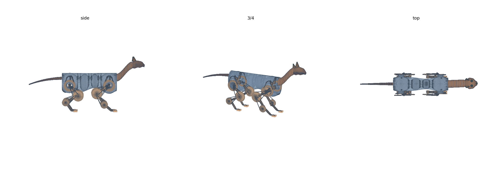
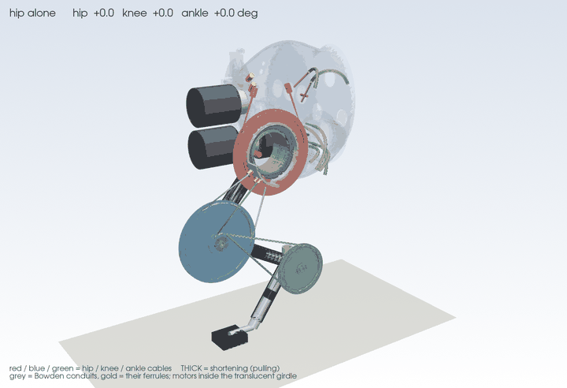
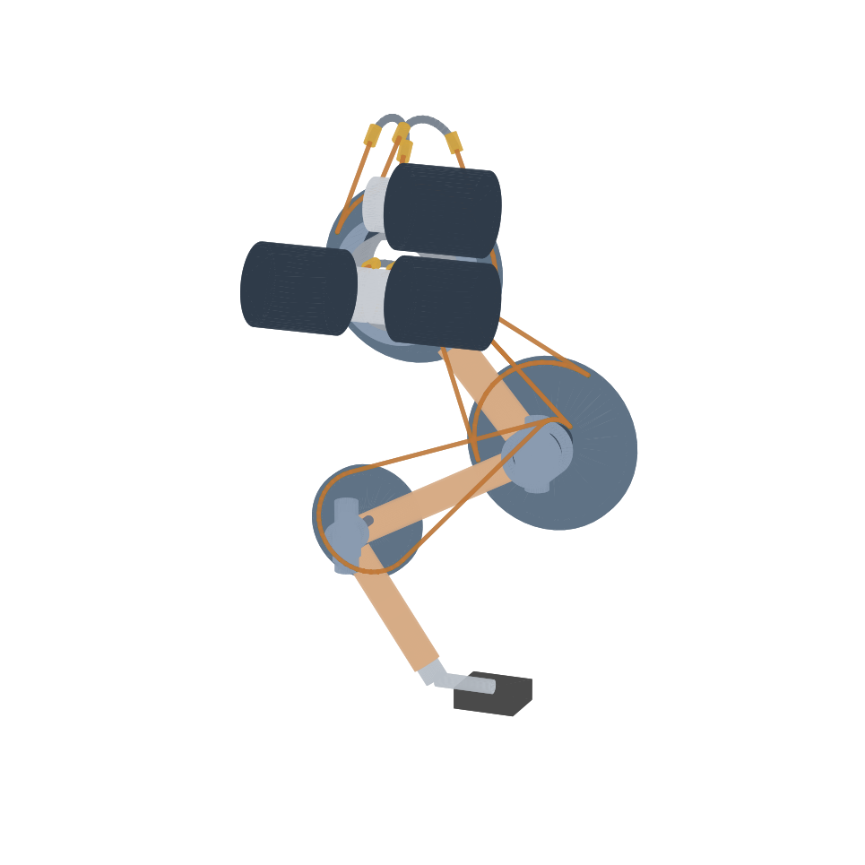
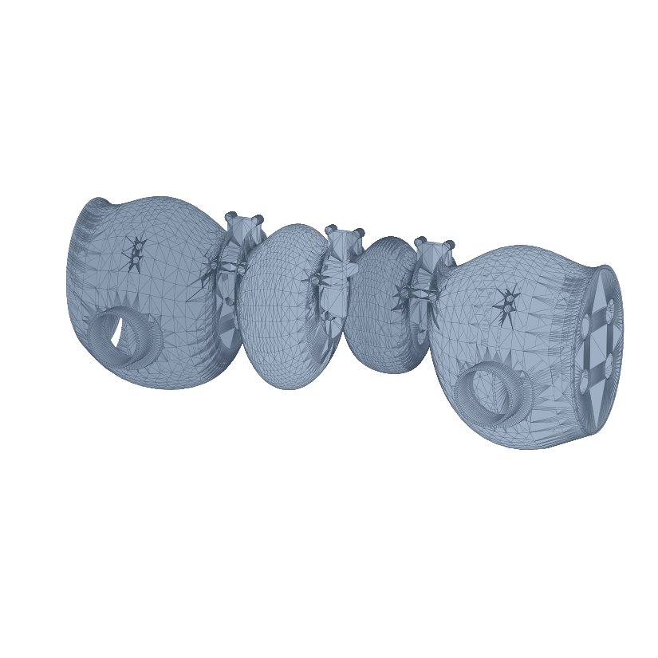

# Project T.O.M.C.A.T.

**Tendon-Operated Mechanism for a Compliant Actuated Tomcat** — an open,
cat-sized quadruped whose joints are pulled by cables from motors in the body,
not driven by a motor at each joint.

[](LICENSE)



## How a leg is driven



Each joint is an antagonistic cable pair wound on one spool, so one motor
drives one joint both ways (red / blue / green = hip / knee / ankle; thick =
the cable pulling).

- **Motors in the body.** Each girdle holds its leg motors in two rows that
  straddle the hip, spools facing across it ([ADR-0114](docs/DESIGN_DECISIONS.md)).
- **Knee and ankle cables run along the hip axis**, through a hollow hip: the
  trunk carries a stub, the femur turns on it in two bearings, and the cables
  never cross the femur's path.
- **Bowden conduits** carry each cable from the body to the leg; friction is
  charged where the cable slides ([ADR-0112](docs/DESIGN_DECISIONS.md)).
- **A series spring (G3)** sits between each motor and its spool: a titanium
  planar flexure, 125 kN/m on the legs and 350 kN/m on the spine
  ([ADR-0107](docs/DESIGN_DECISIONS.md), [ADR-0117](docs/DESIGN_DECISIONS.md)).
- **An articulated, cable-driven spine** (3 segments, pitch and yaw) does the
  balancing sway and the mid-air righting.

| One leg, as parts | The trunk: 19 motors in four rigid bodies |
|---|---|
|  |  |

## Key numbers

| | |
|---|---|
| Mass | **4.58 kg** (19 motors: 12 leg, 6 spine, 1 tail) |
| Trunk / hips apart | 372 mm / 270 mm |
| Joint moment arms (hip / knee / ankle) | 36 / 34 / 22 mm |
| Motor demand (peak / continuous) | 1.65 / 0.57 N·m per motor |
| Trot | 50 cm/s |
| Runtime, trotting | 18–24 min (~710 m) on a 300 g pack |
| Righting from upside down | ~1.0 s (simulated) |

Every number is computed from the live model, not typed in: the CAD, the
MuJoCo plant and the budgets all read `kinematics/src/tomcat_kin/params.py`.

## Status

**Modelling and design — no hardware built.** What is still uncertain, and
what closes it, is in [OPEN_RISKS.md](docs/OPEN_RISKS.md). The largest open
items: the motor (a GIM3505-9 is a proxy for size and mass; the spec it must
meet is in ADR-0100/0110), bench values for conduit friction and the G3 rates,
and a mock-up of the cable bundle that twists inside the hollow hip.

## Repository

| Path | Contents |
|---|---|
| `kinematics/` | `tomcat_kin`: kinematics, tendon maps, mass, gait, balance, MuJoCo plants, RL env |
| `mechanical/cad/` | build123d CAD: trunk, legs, hollow hip, drive, G3 flexure, head, tail, skin |
| `thermal/` | Rust crate: motor and girdle thermal duty |
| `tests/` | pytest suite (556 tests) |
| `docs/` | requirements, architecture, the ADR log, the progress log |
| `electronics/`, `firmware/` | not started |

```bash
pip install numpy pytest mujoco gymnasium build123d vtk matplotlib pillow
pytest tests --ignore=tests/test_mjcf_tendon.py   # conftest.py puts kinematics/src on the path
cd thermal && cargo test
python mechanical/cad/tomcat_assembly.py --render   # the whole-robot picture
python mechanical/cad/leg_drive_3d.py               # the drive animation
```

> ⚠️ `tests/test_mjcf_tendon.py` needs ~19 GB as one process — run it in
> slices. The whole-robot render needs ~12 GB.

## Documents

- [Design decisions (ADR log)](docs/DESIGN_DECISIONS.md) — every choice, and why
- [Progress log](docs/PROGRESS.md) — the milestone-by-milestone record
- [Requirements](docs/REQUIREMENTS.md) · [Architecture](docs/ARCHITECTURE.md) ·
  [Principles](docs/PRINCIPLES.md) · [Open risks](docs/OPEN_RISKS.md)
- [Literature review](docs/LITERATURE_REVIEW.md) · [References](docs/REFERENCES.md) ·
  [Glossary](docs/GLOSSARY.md)

## License

[Apache License 2.0](LICENSE). The feline skeletal geometry derives from
Reighard & Jennings, *Anatomy of the Cat* (1901), public domain; third-party
material is listed in [NOTICE](NOTICE).
