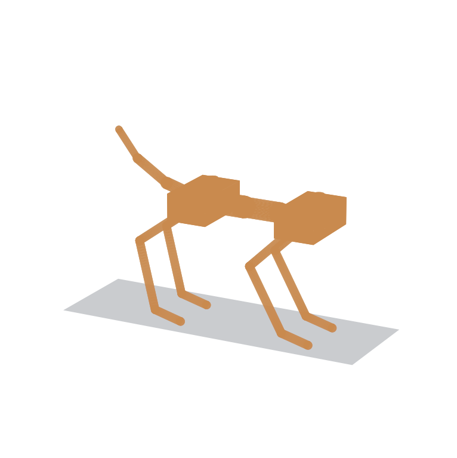

# mechanical/cad/

The first **real 3D geometry** for T.O.M.C.A.T. — a parametric skeleton model
built with [build123d](https://github.com/gumyr/build123d) (code-CAD on the
OpenCascade kernel) and exported to STEP.

Its defining feature: it imports the **same parameters the `tomcat_kin`
simulation uses** (`LegModel`, `DEFAULT_LEG`, `DEFAULT_SPINE`), so the CAD and
the simulation cannot drift apart — change a link length in
`kinematics/src/tomcat_kin/params.py` and this model follows on the next run.
The four legs are posed by solving the leg **IK** for feet planted on the ground.

## Files
- `tomcat_skeleton.py` — the parametric model (source of truth).
- `tomcat_skeleton.step` — CAD interchange (open in any MCAD tool).
- `tomcat_skeleton.png` — rendered preview (below).
- `tomcat_skeleton.stl` — mesh for printing/quick view; **git-ignored** (2 MB,
  regenerated by running the script).



## Run
```
pip install build123d matplotlib      # if not already present
python mechanical/cad/tomcat_skeleton.py
```

## Dimensions (from the model)
| Item | Value | Source |
|------|-------|--------|
| Leg links (thigh/shank/foot) | 120 / 120 / 50 mm | `DEFAULT_LEG` |
| Spine segments (tapered) | 75 / 65 / 55 mm (195 total) | `DEFAULT_SPINE` |
| Hip / body height (standing) | 200 mm | IK stance target |
| Track width (L/R legs) | 90 mm | ❓ placeholder |
| Overall bounding box | 396 (L) × 120 (W) × 313 (H) mm | computed |

## Scope / honesty
This is a **skeleton massing model**, not a manufacturing model:
- Bones are capsules, joints are spheres, girdles/motors are simple prisms and
  cylinders — enough to see scale, proportion, and reach, **not** to fabricate.
- Left/right legs are placed at a chosen track width; the underlying kinematics
  is still the 2D sagittal model, so there is no true frontal-plane geometry yet.
- Body width, bone/vertebra radii, girdle size, and tail shape are **placeholders**.

## Next
A real solid-modelling pass (in a full MCAD tool or a deeper build123d model)
with actual joints, pulleys/moment-arm hardware, tendon routing paths, motor
mounts, and a bill of materials — turning this massing model into parts.
