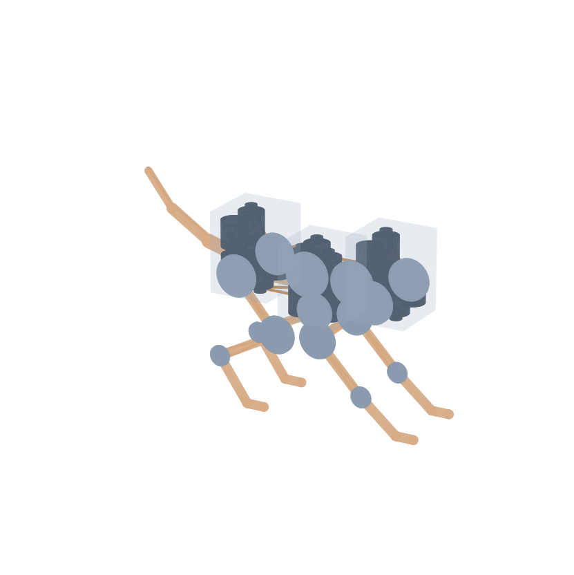
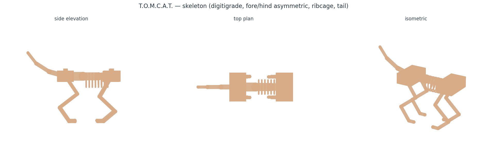
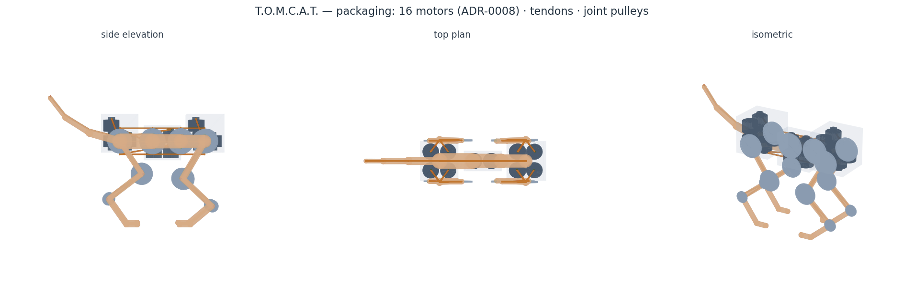

# mechanical/cad/

The first **real 3D geometry** for T.O.M.C.A.T. — a parametric skeleton model
built with [build123d](https://github.com/gumyr/build123d) (code-CAD on the
OpenCascade kernel) and exported to STEP.

Its defining feature: it imports the **same parameters the `tomcat_kin`
simulation uses** (`LegModel`, `DEFAULT_LEG`, `DEFAULT_SPINE`), so the CAD and
the simulation cannot drift apart — change a link length in
`kinematics/src/tomcat_kin/params.py` and this model follows on the next run.
The four legs are posed by solving the leg **IK** for feet planted on the ground.

## Skeletal detail

The skeleton is no longer a capsule massing model — it implements bone **form**,
joint **structure** and joint **axis orientation**, following the public-domain
[ANATOMY.md](../reference/ANATOMY.md) reference and the cat vertebral formula
(C7 / **T13** / **L7** / S3 / Ca~20):

| Feature | How it is modelled | Why it matters |
|---|---|---|
| **Long bones** | shaft + expanded **condyles** at each end | the flare is where a joint bearing seats and a pulley gets its arm |
| **Joint axes** | every actuated joint drawn as a **cylinder along lateral y** | shows structure *and orientation*, not just a blob |
| **Hip / shoulder** | ball (3-DOF in a cat; we actuate the sagittal DOF only) | honest about what is and isn't actuated |
| **Vertebrae** | ~20 presacral bodies with **spinous + transverse processes** | thoracic spines sweep **back**, lumbar **forward**, meeting at the anticlinal vertebra |
| **Actuated spine joints** | only **3**, highlighted in a darker tone | the reader can count what ADR-0006 actually drives |
| **Ribcage** | 8 **C-curved** rib pairs to a **sternum** | encloses a real volume, not decorative rings |
| **Scapula** | sagittal blade sloping down-forward, glenoid at its tip | cats have **no functional clavicle** — the forelimb hangs from this mobile blade, which is also its righting contribution (ADR-0007) |
| **Pelvis** | ilium blade up-forward + ischium back | anchors the hind limb and the tail |
| **Neck / skull / tail** | cervical curve, cranium + muzzle, tapering caudal chain | completes the form |

The legs are **digitigrade** — a 4-link chain (femur/tibia/metatarsus/paw) with 3
actuated joints + a passive paw. The model is **fore/hind asymmetric**: the hind
**stifle bends forward** (negative range) and the fore **elbow bends backward**
(positive range), each derived from that leg's own joint limits via
`LegModel.default_knee`. **Both paws point forward**, as in a cat.

### Stance — crouched, not straight

The limbs stand at **~63 % of leg reach** (hip-to-paw / total reach), matching a
standing cat's ~55–65 %; an earlier revision sat at 70 % and read as
noticeably straight-legged. Deepening the crouch turned out to be nearly **free**:
with a vertical support force the **hip** torque depends only on the foot's
horizontal offset, and the **hock** torque is fixed by the paw geometry, so a
deeper crouch loads **only the stifle** (0.14 → 0.34 N·m at trot) — far below the
binding hip/hock. Stability margin is unchanged and ~10° of joint-limit margin
remains over the gait cycle, so the gait adopted the same stance.

A geometry bug surfaced while checking this: the forelimb hangs from the
scapula's **glenoid**, which sits ~17 mm *below* the hip, but every limb was
solving for one global ground drop — so the **front paws sat 17 mm underground**.
Each limb now solves for its own mount-to-ground distance.

### Two component placements this detail justified

1. **The spinous process height *is* the spine tendon moment arm.** The 30 mm arm
   in `SpineParams` was an abstract pulley radius; it is now the dorsal process
   the tendon actually bears on, so CAD and parameter agree by construction
   (`SPINOUS_H` is read from `DEFAULT_SPINE.joint_moment_arm`).
2. **The battery / electronics moved *inside* the thoracic basket.** The earlier
   model put a "mid-body bay" box in the belly with no structural justification.
   The ribcage is the natural home: protected, central, low, and near the CoM.

## Files
- `tomcat_skeleton.py` — the parametric model (source of truth).
- `tomcat_skeleton.step` — CAD interchange (open in any MCAD tool).
- `tomcat_skeleton.png` — rendered preview (below).
- `tomcat_skeleton.stl` — mesh for printing/quick view; **git-ignored** (2 MB,
  regenerated by running the script).


## Run
```
pip install build123d matplotlib      # if not already present
python mechanical/cad/tomcat_skeleton.py
```

## Dimensions (from the model)
| Item | Value | Source |
|------|-------|--------|
| Hind-leg links (femur/tibia/metatarsus/paw) | 90 / 95 / 70 / 25 mm | `DEFAULT_LEG` (digitigrade) |
| Fore-leg links (humerus/radius/metacarpus/paw) | 100 / 90 / 65 / 25 mm | `DEFAULT_FORELEG` (columnar) |
| Actuated joints per leg | 3 (hip · stifle · hock) + passive paw | `LegParams` |
| Spine segments (tapered) | 75 / 65 / 55 mm (195 total) | `DEFAULT_SPINE` |
| Hip / body height (standing) | 170 mm | IK stance target, ~63 % extension |
| Track width (L/R limbs) | 96 mm | ❓ placeholder |
| Vertebrae drawn / actuated spine joints | 20 (T13 + L7) / **3** | `ANATOMY.md` / ADR-0006 |
| Spinous process height = spine tendon arm | 30 mm | `DEFAULT_SPINE.joint_moment_arm` |
| Overall bounding box | 427 (L) × 115 (W) × 262 (H) mm | computed |

## Scope / honesty
This is a **skeletal model**, not a manufacturing model:
- Bone *form* and joint *axes* are modelled, but there are **no fasteners,
  bearings, tolerances or fabrication features** — nothing here is machinable
  as drawn. That is review finding **F5**, still open.
- Left/right limbs are placed at a chosen track width; the underlying kinematics
  is still the **2D sagittal** model, so there is no true frontal-plane geometry
  yet — the top plan is a projection, not a solved 3D pose.
- The kinematics model has **no scapula** (it mounts the forelimb on the girdle
  frame), so CAD and model differ slightly at the shoulder *by design*: the model
  is the authority for stability, the CAD for form.
- Body width, bone/vertebra radii, girdle size, tail shape and every dimension
  driven by `params.py` remain **placeholders**.

## Packaging model — motors · tendons · joints

`tomcat_packaging.py` extends the skeleton with the *internal* layout: it places
**one motor per driven tendon**, clustered in the girdles (P1), routes **tendons**
from each motor spool along the limb/spine to the joint it drives, and puts
**pulleys** at every joint (hip/knee/ankle + vertebrae) at their real moment-arm
radii. The girdle housings are **sized to enclose the motor banks** — so it is a
genuine fit check, not a fixed box.



`python mechanical/cad/tomcat_packaging.py` → `tomcat_packaging.step` + `.png`.
Render colours: bone = tan, **motor = slate**, **tendon = copper**, pulley = steel,
girdle = translucent.

### Multi-view renders

`render_views.py` produces legible three-view figures (side elevation · top plan ·
isometric) for both models — clearer than the single iso the build scripts emit:





### Fit findings — re-packed for **19 motors** (ADR-0008 + ADR-0009)

[ADR-0008](../../docs/DESIGN_DECISIONS.md) cut the count 24 → **16** (one
variable-radius-pulley motor per DOF) and the
[down-select](../../docs/notes/motor-downselect.md) replaced the Ø16 × 28 mm
placeholder with a realistic **Ø36 × 26 mm, ~74 g pancake QDD** module. Both
changes invalidated the earlier F4 packing, so it was redone.

⚠️ **Re-packed again for the REAL motor.** The surveyed part is
**Ø34.5 × 36.1 mm** — very close in diameter to the placeholder but **39 %
longer**. Because the banks stack along z, that goes straight into girdle
**height**: 88 → **108 mm**. Width is unaffected and still clears the 96 mm
track, so nothing collides — but it confirms the earlier F4 verdict that the
torso is, honestly, a motor box.

[ADR-0009](../../docs/DESIGN_DECISIONS.md) then added the **spine LATERAL bend**
DOF, taking the count **16 → 19**. The three extra motors join the spine bank in
the mid-body bay, which is why that bay grew and now packs 2 × 2 rather than
2 × 1 — seven motors stacked two per layer would tower 152 mm out of a 113 mm-wide
cat.

| Result | Value |
|--------|-------|
| Motors | **19** — 12 leg DOF (3/leg) + 3 spine dorsoventral + **3 spine lateral** + 1 tail |
| Motor envelope | **Ø34.5 × 36.1 mm, 131.7 g** `[sourced: SteadyWin GIM3505-9 + driver]` — replaces the Ø36 × 26 mm / 74 g class target, which does not exist ([reality check](../../docs/notes/motor-reality-check.md)) |
| Shoulder girdle | **82 × 86 × 108 mm** (6 motors, 2 per layer) |
| Pelvic girdle | **82 × 86 × 108 mm** (6 motors) |
| Mid-body bay | **82 × 82 × 100 mm** (3 spine + 3 lateral + 1 tail, 2 × 2 per layer) |
| Width vs 96 mm leg track | **86 mm — still fits** |
| Overall | 426 × 113 × 281 mm |

**Two layout decisions this forced:**

1. **Upright, stacked motors.** Real Ø36 pancakes only fit ~2 per layer inside a
   cat torso, so each bank stacks in z. Girdles are now 88 mm tall — the torso is
   frankly a motor box, which is the honest consequence of P1 centralization.
2. **A third, mid-body bay.** The spine + tail bank no longer fits in the pelvic
   girdle without stretching it to 173 mm (over half the 195 mm spine). It moved
   to the **belly between the girdles** — otherwise empty volume, still
   "centralized" per P1, and a natural spot for the battery too.

> ⚠️ **This third cluster is not in [ADR-0005](../../docs/DESIGN_DECISIONS.md)**,
> which specifies shoulder + pelvic girdle clusters and a tail node on the CAN-FD
> bus. A mid-body node is a small topology change that should be reflected there.

<details><summary>Superseded: the original 24-motor F4 finding</summary>

The first layout laid motors **axis-along-Y**, so each body + spool projected
sideways from banks at y = ±42 — a **142 mm** girdle against a 96 mm track, and a
91 mm-tall pelvis. Standing them upright fixed it (142 → 87 mm) at 24 motors of
the old small placeholder. The numbers above supersede that pass.
</details>

## Next
A real solid-modelling pass with actual motor part solids, bearing/pulley
hardware, cable anchors, and mounts — turning this layout study into parts and a
BOM (review F5). The girdle-packaging finding (F4) is resolved above.
